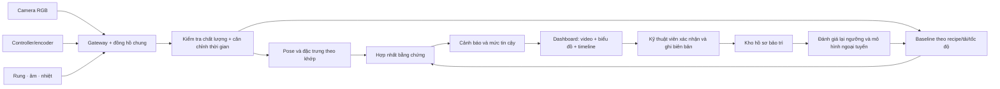
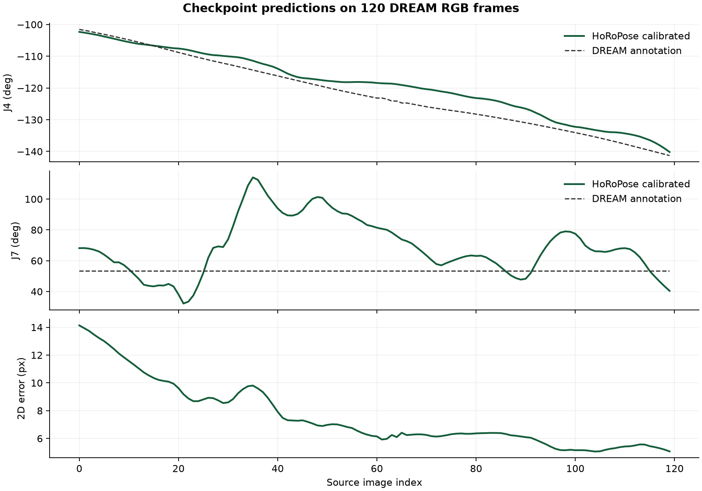
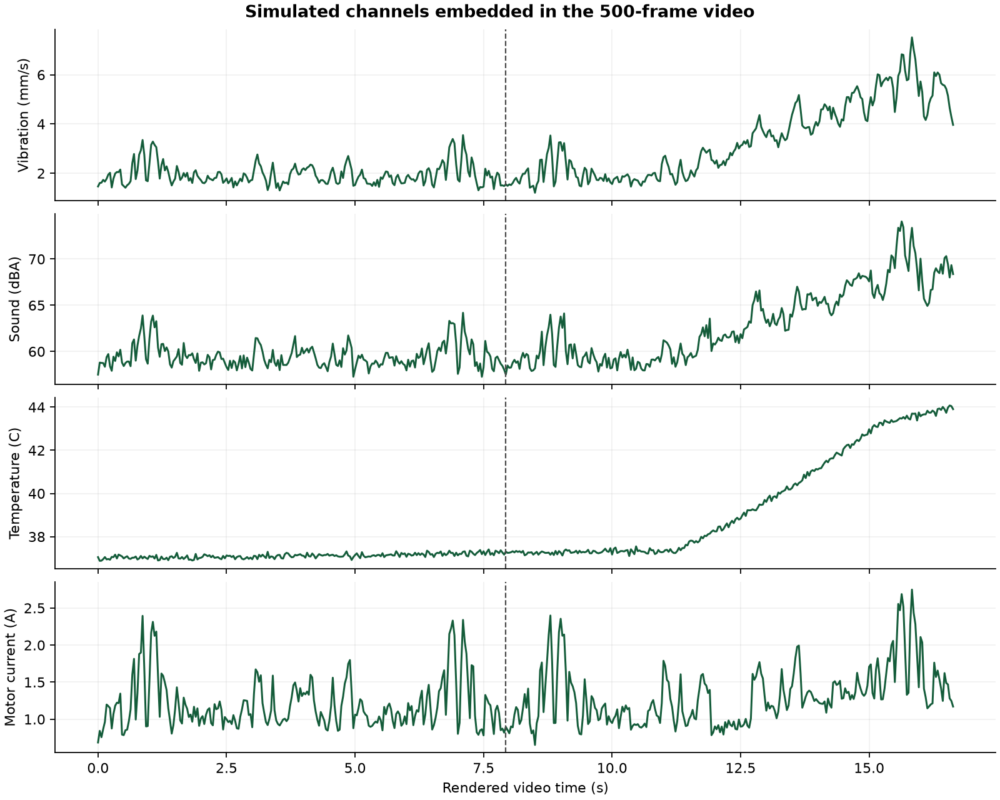

# BÁO CÁO ĐỒ ÁN

# Thiết kế hệ thống giám sát tư thế robot Franka Panda và mô phỏng cảnh báo bảo trì đa cảm biến

**Lĩnh vực:** trí tuệ nhân tạo, thị giác máy tính, robot công nghiệp và bảo trì dựa trên tình trạng thiết bị<br>
**Phiên bản báo cáo:** 06/10/2026<br>
**Mã nguồn và dữ liệu tái lập:** [DENS0-2026](https://github.com/manhhung-25/DENS0-2026)<br>
**Sinh viên / nhóm thực hiện:** [Điền tên]<br>
**Giảng viên hướng dẫn:** [Điền tên]
**Đơn vị đào tạo:** [Điền tên]

> Báo cáo mô tả đúng nguyên mẫu đã chạy và hướng triển khai tiếp theo. Các trang trong sườn mẫu chỉ là ví dụ; số trang cần được cập nhật sau khi dàn trang Word/PDF. Những mục 41/68 landmark, ESP32-S3 và nhận diện hành vi người trong sườn mẫu không thuộc đề tài robot này nên đã được thay bằng nội dung tương ứng.

## TÓM TẮT

Nhà máy thường có ít bản ghi hỏng hóc được xác nhận vì robot cần vận hành liên tục và không thể cố tình làm hỏng thiết bị để tạo dữ liệu. Theo bối cảnh bài toán do phía nhà máy nêu, theo dõi một kênh rung cũng có thể bỏ sót các sai lệch tư thế, độ trễ chuyển động, biến đổi nhiệt và âm. Đồ án đề xuất hệ thống kết hợp ảnh RGB, rung, âm thanh, nhiệt độ và dữ liệu bộ điều khiển khi được phép truy cập; xác định vị trí có dấu hiệu bất thường; lưu cửa sổ bằng chứng; và cho kỹ thuật viên xác nhận hoặc sửa nguyên nhân sau bảo trì.

Nguyên mẫu hiện tại dùng 120 ảnh RGB Franka Panda và annotation từ tập DREAM, checkpoint HoRoPose để ước lượng bảy góc khớp, pose gốc và bảy keypoint. Video 16,67 giây gồm 500 frame được dựng từ 120 ảnh theo hai chu kỳ, trong đó có một đoạn giữ hình 24 frame để minh họa trễ. Dashboard FastAPI phát lại video, ánh xạ từng frame với kết quả HoRoPose và các biểu đồ. Dữ liệu rung, âm, nhiệt, dòng điện và mọi sự cố trong video hoặc phòng mô phỏng đều **được sinh tổng hợp**, không phải cảm biến gắn trên robot.

Việc tái lập trên CPU với checkpoint được đóng gói suy luận thành công 120/120 ảnh và nạp nghiêm ngặt 2.308 tensor. Sai số keypoint 2D trung bình sau lọc là 7,554 pixel; MAE góc khớp sau hiệu chỉnh bằng 30 nhãn đầu là 5,529° trên đoạn DREAM. Một mô hình ExtraTrees trên dữ liệu lỗi tổng hợp đạt 100% ở phép chia ngẫu nhiên nội bộ, song kết quả này không chứng minh khả năng chẩn đoán lỗi cơ khí thực tế. Đóng góp của đồ án là một chuỗi tái lập được từ ảnh và checkpoint đến video, biểu đồ, mô phỏng lỗi, cảnh báo và phản hồi bảo trì, đồng thời chỉ ra điều kiện cần để kiểm định tại nhà máy.

**Từ khóa:** HoRoPose, Franka Panda, robot pose estimation, condition monitoring, predictive maintenance, multimodal sensor fusion, synthetic fault injection.

## LỜI CAM ĐOAN

Đây là mẫu lời cam đoan để **sinh viên thực hiện tự xác nhận và ký**, không phải xác nhận thay người nộp báo cáo:

“Tôi/nhóm chúng tôi cam đoan phần mã tích hợp, phân tích và trình bày trong báo cáo được thực hiện và dẫn nguồn đúng quy định. Mã HoRoPose, tập DREAM, checkpoint và các công cụ bên thứ ba được ghi rõ nguồn. Các số liệu từ dữ liệu mô phỏng được phân biệt với kết quả trên ảnh thật; không trình bày cảnh báo mô phỏng như kết quả bảo trì tại nhà máy. Tôi/nhóm chúng tôi chịu trách nhiệm về tính chính xác của phần việc đã thực hiện.”

Ngày ... tháng ... năm ...<br>
Người thực hiện: ........................................

## DANH MỤC CHỮ VIẾT TẮT

| Viết tắt | Nghĩa |
|---|---|
| AI | Trí tuệ nhân tạo |
| RGB | Ảnh màu ba kênh đỏ, xanh lá và xanh lam |
| CV | Computer Vision, thị giác máy tính |
| DoF | Degrees of Freedom, bậc tự do |
| FK | Forward Kinematics, động học thuận |
| GT | Ground Truth, nhãn đối chiếu của tập dữ liệu |
| MAE | Mean Absolute Error, sai số tuyệt đối trung bình |
| NPZ | Định dạng lưu nhiều mảng NumPy |
| RMS | Root Mean Square, giá trị hiệu dụng |
| PnP | Perspective n Point, ước lượng pose từ điểm 2D/3D |
| ROI | Region of Interest, vùng ảnh quan tâm |
| FPR | False Positive Rate, tỷ lệ báo động giả |
| RUL | Remaining Useful Life, tuổi thọ còn lại ước lượng |
| API | Application Programming Interface |
| OEM | Nhà sản xuất thiết bị gốc |
| LFS | Git Large File Storage |

## DANH MỤC BẢNG

| Mã | Tên bảng |
|---|---|
| Bảng 1.1 | So sánh hướng tiếp cận liên quan |
| Bảng 2.1 | Các thành phần có thật trong nguyên mẫu |
| Bảng 2.2 | Sai số pose trên 120 ảnh DREAM Panda |
| Bảng 2.3 | Thông số kỹ thuật có thể đối chiếu trong kho |
| Bảng 3.1 | Tiêu chí nghiệm thu đề xuất cho pilot |
| Bảng 3.2 | Cấu hình thu thập dự kiến |
| Bảng 3.3 | Ma trận biểu hiện lỗi trong dashboard và bằng chứng dự kiến |
| Bảng 3.4 | Ngưỡng luật demo, chưa hiệu chuẩn hiện trường |
| Bảng 4.1 | Kết quả chạy thử chức năng đã xác minh |
| Bảng 4.2 | Điều có thể và chưa thể kết luận từ nguyên mẫu |
| Bảng A.1 | Dự toán cần điền sau khảo sát nhà máy |

## DANH MỤC HÌNH ẢNH

| Mã | Tên hình |
|---|---|
| Hình 3.1 | Kiến trúc dữ liệu, mô hình và phản hồi bảo trì |
| Hình 4.1 | Góc khớp dự đoán và sai số keypoint trên 120 ảnh DREAM |
| Hình 4.2 | Bốn kênh cảm biến mô phỏng trong video 500 frame |

## MỤC LỤC

1. Tóm tắt; Lời cam đoan; Danh mục chữ viết tắt, bảng và hình ảnh.
2. Phần mở đầu: lý do, mục tiêu, đối tượng, ý nghĩa, phương pháp, phạm vi.
3. Chương 1: tổng quan nghiên cứu, cơ sở lý luận, cơ sở thực tiễn.
4. Chương 2: thực trạng vấn đề và nguyên mẫu hiện có.
5. Chương 3: giải pháp triển khai hệ thống.
6. Chương 4: kết quả nghiên cứu và giới hạn.
7. Kết luận; Tài liệu tham khảo; Phụ lục.

## PHẦN MỞ ĐẦU

### 1. Lý do chọn đề tài

Một sự cố ở cánh tay robot có thể làm dừng dây chuyền, phát sinh chi phí kiểm tra và ảnh hưởng sản phẩm. Bài toán do phía nhà máy trình bày là dữ liệu rung bất thường hiếm; trường hợp rõ ràng nhất thường chỉ xuất hiện khi máy đã hỏng. Việc tạo lỗi có chủ đích trên robot sản xuất sẽ tốn kém và khó chấp nhận. Cần cách thu được bằng chứng sớm hơn, ở nhiều kênh hơn, đồng thời thử thuật toán với dữ liệu lỗi giả lập mà không tác động đến thiết bị thật.

Xu hướng công nghiệp đã có các sản phẩm theo dõi tình trạng robot như [FANUC ZDT](https://www.fanucamerica.com/products/software/robot/zero-down-time-zdt) và [KUKA iiQoT](https://www.kuka.com/en-gb/products/robotics-systems/software/cloud-software/iiqot-robot-condition-monitoring). Đây là minh chứng về nhu cầu, không phải bằng chứng rằng nguyên mẫu trong báo cáo đạt cùng hiệu năng. Hướng xây dựng bộ dữ liệu từ mô phỏng nhiều điều kiện cũng được mô tả trong [tài liệu Predictive Maintenance Toolbox của MathWorks](https://www.mathworks.com/help/predmaint/ug/generate-and-use-simulated-data-ensemble.html). Cách tiếp cận của đồ án là đặt camera và dữ liệu pose vào chuỗi bằng chứng bên cạnh các kênh cảm biến.

### 2. Mục tiêu nghiên cứu

**Mục tiêu tổng quát:** thiết kế và chứng minh nguyên mẫu phần mềm có thể đồng bộ ảnh robot, pose AI, tín hiệu cảm biến, cảnh báo và xác nhận bảo trì trên cùng một trục thời gian, đồng thời tạo tình huống lỗi ngoại tuyến để thử quy trình mà không làm hỏng robot.

**Mục tiêu đã thực hiện:** (i) giải nén và kiểm tra gói dữ liệu/kiến trúc HoRoPose; (ii) suy luận lại trên 120 ảnh DREAM; (iii) dựng lại video; (iv) nối q1–q7, keypoint và CSV 500 frame với dashboard; (v) mô phỏng sáu kiểu tác động what-if; (vi) lưu cảnh báo và phản hồi kỹ thuật viên; (vii) công bố mã, checkpoint và lệnh tái lập trên GitHub LFS.

**Mục tiêu giai đoạn sau:** thu nhận cảm biến và bộ điều khiển thực; hiệu chuẩn đồng hồ, camera và điều kiện tải; thiết lập baseline khỏe; thu thập nhãn bảo trì; đo tỷ lệ báo động giả, thời gian báo trước và độ chính xác chẩn đoán trên ca vận hành chưa từng dùng để phát triển hệ thống.

### 3. Đối tượng và khách thể nghiên cứu

Đối tượng nghiên cứu là chuỗi dữ liệu trạng thái cánh tay robot gồm ảnh RGB, pose/góc khớp suy luận, rung, âm thanh, nhiệt độ, dòng điện và thời gian chu kỳ. Khách thể dự kiến là robot công nghiệp vận hành lặp lại theo chương trình trong dây chuyền; nguyên mẫu kiểm chứng trên ảnh Franka Panda từ DREAM, **chưa** chạy trên robot của nhà máy. Các chức năng bảo trì hướng tới kỹ thuật viên, kỹ sư độ tin cậy và người quản lý ca máy.

### 4. Ý nghĩa khoa học

Đề tài đặt ra ba vấn đề có thể kiểm chứng: độ chính xác của pose ước lượng từ ảnh khi không dựa vào encoder tại thời điểm suy luận; sự nhất quán thời gian của các kênh dữ liệu; và khả năng phân biệt báo động thật với nhiễu, thay đổi tải hoặc lỗi cảm biến. Điểm đáng chú ý của nguyên mẫu là mọi hình và biểu đồ được truy vết tới `scene_id`, `frame` và `time_s`, nên có thể tái lập và kiểm toán. Đồ án không nhận công lao huấn luyện HoRoPose gốc; phần đó thuộc nhóm tác giả [Ban và cộng sự, ECCV 2024](https://www.ecva.net/papers/eccv_2024/papers_ECCV/papers/06496.pdf).

### 5. Phương pháp nghiên cứu

Phương pháp gồm khảo cứu tài liệu gốc; phân tích mã nguồn và manifest; kiểm tra SHA-256; chạy lại suy luận với checkpoint được đóng gói; đối chiếu dự đoán với nhãn DREAM; kiểm tra timeline NPZ–CSV–video; thiết kế bộ sinh lỗi có tham số; kiểm thử API và giao diện; và so sánh giữa kết quả đo được với các tiêu chí thí điểm đề xuất. Bất kỳ thông số nào chưa có phép đo trên robot thật đều được ghi là **đề xuất**, không trình bày như kết quả thực nghiệm.

### 6. Phạm vi nghiên cứu

Phạm vi đã thực hiện là phát lại ngoại tuyến trên một đoạn 120 ảnh nguồn, 500 frame render, một cấu hình camera DREAM và dữ liệu sự cố tổng hợp. Dashboard không nhận luồng camera trực tiếp, không kết nối điều khiển robot, không phát lệnh chạy/dừng và không suy ra RUL. Độ chính xác trên ảnh DREAM không được ngoại suy thành độ chính xác dự báo hỏng hóc tại nhà máy.

## PHẦN NỘI DUNG

## CHƯƠNG 1. TỔNG QUAN NGHIÊN CỨU, CƠ SỞ LÝ LUẬN VÀ CƠ SỞ THỰC TIỄN

### 1.1. Tổng quan nghiên cứu

[DREAM của NVIDIA](https://research.nvidia.com/publication/2020-05_camera-robot-pose-estimation-single-image) dùng mạng học sâu phát hiện keypoint robot từ RGB và kết hợp hình học PnP để ước lượng quan hệ camera–robot. Kho [DREAM](https://github.com/NVlabs/DREAM) cung cấp ảnh thật, ảnh tổng hợp, mã và nhãn; tài liệu nguồn lưu ý vị trí keypoint Panda theo URDF có thể không trực quan như vị trí cơ khí nhìn bằng mắt. Giấy phép mã DREAM được công bố là NVIDIA Source Code License Non-commercial, vì vậy cần rà soát quyền sử dụng dữ liệu/mã khi chuyển sang mục đích thương mại.

[HoRoPose](https://www.ecva.net/papers/eccv_2024/papers_ECCV/papers/06496.pdf) xử lý bài toán ước lượng trạng thái robot từ RGB khi trạng thái khớp không được cung cấp; kiến trúc gồm các thành phần dự đoán góc khớp, rotation, depth và keypoint trong một lượt feed-forward. [Kho mã chính thức](https://github.com/Oliverbansk/Holistic-Robot-Pose-Estimation) công bố cấu hình Panda, checkpoint và quy trình huấn luyện nhiều giai đoạn. Đồ án dùng checkpoint đã huấn luyện, không huấn luyện lại HoRoPose từ đầu.

Trong bảo trì, [FANUC ZDT](https://www.fanuc.co.jp/en/product/robot/function/zdt.html) kết hợp giám sát, truy vết và thông báo bảo trì; [KUKA iiQoT](https://www.kuka.com/en-gb/products/robotics-systems/software/cloud-software/iiqot-robot-condition-monitoring) đưa dữ liệu tình trạng robot lên hệ thống theo dõi. [ABB RobotStudio](https://www.abb.com/global/en/areas/robotics/products/software/robotstudio-suite) cho phép lập trình và mô phỏng robot ngoại tuyến, giảm việc thử thay đổi trực tiếp trên dây chuyền. Các hệ thống đó gợi ý kiến trúc thí điểm và nguyên tắc thử an toàn; đồ án chưa tích hợp sản phẩm của các hãng.

**Bảng 1.1. So sánh hướng tiếp cận liên quan**

| Hướng | Dữ liệu đầu vào | Giá trị cho đề tài | Ranh giới |
|---|---|---|---|
| DREAM | RGB, nhãn keypoint/camera | Nguồn ảnh và nhãn kiểm thử | Không cung cấp nhãn hỏng robot |
| HoRoPose | RGB, checkpoint robot pose | q, pose 6D, keypoint từ ảnh | Không phải mô hình dự báo hỏng |
| Giám sát tình trạng thương mại | Telemetry robot và lịch sử vận hành | Gợi ý cảnh báo và bảo trì | Không chứng minh chất lượng nguyên mẫu |
| Mô phỏng ngoại tuyến | Mô hình, tham số tải/lỗi | Tạo tập thử không làm hỏng thiết bị | Sai khác với lỗi thật cần định lượng |

### 1.2. Cơ sở lí luận

**Động học và hình chiếu.** Franka Panda có bảy biến khớp quay trong pipeline này; trạng thái được ký hiệu `q = (q1,…,q7)`. Với mô hình động học thuận, tọa độ keypoint 3D là `X_j(q)`. Phép chiếu camera pinhole dùng ma trận nội tại `K`: `u_j = π(K X_j)`, trong đó `π([x,y,z])=(x/z,y/z)`. Khoảng cách Euclid giữa keypoint dự đoán và nhãn 2D là đại lượng dùng đánh giá ảnh; nó không đo trực tiếp độ rơ cơ khí.

**Ước lượng trạng thái từ RGB.** Mô hình nhận crop ảnh và tham số camera, xuất `q`, rotation 6D, translation gốc và keypoint 3D. Adapter trong dự án dùng bbox lấy từ annotation DREAM để tạo đầu vào và dùng 30 frame nhãn khớp đầu để tính offset trung vị: `b = median(q_smooth - q_GT)`; `q_cal = q_smooth - b`. Vì thế MAE sau hiệu chỉnh là kết quả **có hỗ trợ nhãn** và bao gồm các frame dùng hiệu chỉnh; không phải phép thử trên luồng RGB bất kỳ không có nhãn.

**Theo dõi tình trạng và cảm biến.** Rung gợi ý biến đổi năng lượng cơ học, âm thanh ghi nhận tiếng động, nhiệt độ phản ánh quá trình tích nhiệt, còn pose và thời gian chu kỳ cho biết quỹ đạo/thời điểm chuyển động. Một kênh có thể nhiễu bởi tải, gá cảm biến hay môi trường. Ghép nhiều kênh chỉ có giá trị khi biết timestamp, chương trình, tải và điều kiện nền. [ISO 17359:2018](https://www.iso.org/standard/71194.html) là hướng dẫn chung cho việc thiết lập chương trình theo dõi tình trạng máy; báo cáo dùng nó như tham chiếu tổ chức phép đo, không tuyên bố hệ thống đã được chứng nhận theo tiêu chuẩn.

**Phát hiện bất thường và dự báo.** Phát hiện bất thường trả lời liệu dữ liệu hiện tại lệch khỏi trạng thái tham chiếu hay không; chẩn đoán đưa ra giả thuyết nguyên nhân; dự báo hỏng đòi hỏi dữ liệu tiến triển theo thời gian và xác nhận thời điểm hỏng/bảo trì để ước lượng nguy cơ hoặc RUL. Nguyên mẫu mới minh họa hai bước đầu trên lỗi tổng hợp. Không có cơ sở khoa học để suy ra thời gian còn hoạt động từ 16,67 giây video phát lại.

### 1.3. Cơ sở thực tiễn

Bài toán được mô tả tại nhà máy là chi phí tạo lỗi thật cao và kênh rung đơn lẻ không đủ bao phủ. Hướng hợp lý là bắt đầu với dữ liệu vận hành khỏe, phân tầng theo recipe/tải/tốc độ, sau đó thử hệ thống bằng mô phỏng, dữ liệu bench test và cuối cùng là hồ sơ bảo trì thật. Tài liệu [MathWorks về simulated data ensemble](https://www.mathworks.com/help/predmaint/ug/data-ensembles-for-condition-monitoring-and-predictive-maintenance.html) minh họa việc thay đổi tham số lỗi và điều kiện hoạt động để tạo nhiều ca, đồng thời ghi rõ biến dữ liệu, biến điều kiện và nhãn. Điều đó hỗ trợ **kiểm thử thuật toán**, không thay thế đánh giá trên robot nhà máy.

# CHƯƠNG 2. THỰC TRẠNG VẤN ĐỀ NGHIÊN CỨU

## 2.1. Nhu cầu sử dụng và bối cảnh thị trường

Nhà máy muốn nhận biết sớm sự lệch chuẩn của robot trước khi phải dừng dây chuyền. Điều kiện quan trọng là không cố ý làm hỏng cánh tay để thu thập dữ liệu. Các giải pháp thương mại như [FANUC ZDT](https://www.fanucamerica.com/products/software/robot/zero-down-time-zdt) và [KUKA iiQoT](https://www.kuka.com/en-gb/products/robotics-systems/software/cloud-software/iiqot-robot-condition-monitoring) cho thấy hướng theo dõi tình trạng thiết bị và quản lý bảo trì đã được áp dụng. Tuy nhiên, tính năng, giao thức và mô hình dữ liệu của các sản phẩm này không mặc nhiên chuyển được sang Franka Panda. Đề tài chọn một nguyên mẫu mở, giải thích được nguồn dữ liệu, phù hợp giai đoạn ý tưởng.

## 2.2. Hiện trạng mã nguồn và hai nhánh sản phẩm

Kho mã hiện có gồm hai nhánh chức năng liên quan nhưng mục đích khác nhau. `panda_repro/` đóng gói dữ liệu DREAM, checkpoint HoRoPose, mã suy luận, bảng dự đoán và video có thể tái lập. `pose_focus_demo/` cung cấp web dashboard, bộ tạo tín hiệu và lỗi kiểu *what-if*, luật cảnh báo, biểu đồ cùng cơ chế phản hồi kỹ thuật viên. Bảng 2.1 chỉ rõ ranh giới bằng chứng.

**Bảng 2.1. Các thành phần có thật trong nguyên mẫu**

| Thành phần | Đầu vào/đầu ra | Trạng thái kiểm chứng | Giới hạn |
|---|---|---|---|
| DREAM Panda RealSense | 120 ảnh RGB 480 × 640, nhãn khớp/keypoint/camera | Có tệp trong kho | Ảnh tĩnh, không phải camera trực tiếp ở nhà máy |
| HoRoPose Panda | Ảnh và crop → 7 biến khớp, keypoint, pose 6D | Checkpoint tải nghiêm ngặt và suy luận CPU chạy lại 120/120 ảnh | Crop dùng bbox nhãn; hiệu chuẩn dùng nhãn 30 ảnh đầu |
| Video demo | 500 frame, 1280 × 720, 30 fps | Tệp video và CSV được tạo từ kịch bản | Các frame lặp tiến/lùi ảnh nguồn; 16,67 giây video không phải 16,67 giây đo thực |
| Cảm biến rung, âm, nhiệt, dòng | Chuỗi theo frame | Sinh bởi mã mô phỏng, cùng chỉ số frame | Không có phép đo vật lý hay đơn vị đã hiệu chuẩn tại robot |
| Bộ phân loại ExtraTrees | Đặc trưng chu kỳ → nhãn lỗi/khớp | Huấn luyện và kiểm thử trên dữ liệu tổng hợp | Không có xác nhận độc lập bằng lỗi thật |
| Web dashboard | Video, biểu đồ, cảnh báo, phản hồi | API và giao diện chạy được | Đồng bộ theo đồng hồ phát video, chưa nhận luồng cảm biến sống |

## 2.3. Hiện trạng phần cứng và môi trường chạy

Nguyên mẫu hiện tại chạy trên máy tính thông thường với Python và trình duyệt. Kho mã **không kèm robot Franka đang kết nối, PLC, camera live, bộ thu rung, micro, đầu dò nhiệt hay bản ghi encoder có timestamp**. Như vậy, không có cơ sở báo cáo đặc tính thu mẫu, độ trễ mạng, độ tin cậy cảm biến hoặc khả năng cảnh báo trong dây chuyền thật. Tên robot Panda và ảnh RGB khớp với đối tượng mô phỏng, nhưng không đồng nghĩa có quyền truy cập API điều khiển robot. Khi chuyển sang pilot, cần làm việc với nhà máy về model, vị trí camera, quyền đọc controller, điểm gắn sensor, điều kiện an toàn và đồng hồ chung.

Môi trường tái lập trong README sử dụng Python, thư viện học máy và web. Checkpoint gốc xấp xỉ 319,9 MB; thao tác suy luận trên CPU cần RAM và thời gian phù hợp. Tốc độ video 30 fps là tốc độ phát tệp, **không phải FPS suy luận HoRoPose đã đo**.

**Bảng 2.3. Thông số kỹ thuật có thể đối chiếu trong kho**

| Mục | Giá trị trong nguyên mẫu | Nơi đối chiếu |
|---|---|---|
| Ảnh nguồn | 120 RGB, 480 × 640 pixel | `panda_repro/data/panda_realsense/` |
| Video dựng | 500 frame, 1280 × 720 pixel, 30 fps, 16,67 s | `panda_repro/artifacts/` và script dựng |
| Pose | 7 góc tay, 1 biến gripper, 7 keypoint 2D/3D, pose gốc 6D | `horopose_panda.py` |
| Mạng | ResNet50 + HRNet32; crop 256 × 256; 4 vòng lặp | Cấu hình HoRoPose adapter |
| Checkpoint | 319.892.449 byte; SHA-256 `9c531ede1e32fcfc1d51a92cdef63f285483786730edda35e73838026c181c3c` | `panda_repro/checkpoints/horopose_panda_realsense_inference.pk` |
| Web | Python 3.12; FastAPI 0.141.1; Uvicorn 0.52.3; Pydantic 2.13.4; NumPy 2.5.2 | `requirements.txt` và README |
| Bộ phân loại tổng hợp | 6.000 chu kỳ, 96 bước/chu kỳ, 97 đặc trưng, hai mô hình ExtraTrees × 260 cây | `train_fault.py`, `faults.py`, metrics |

## 2.4. Hạn chế của dữ liệu ảnh và điều kiện camera

Tập 120 ảnh dùng trong nguyên mẫu có góc nhìn và điều kiện chụp hữu hạn. RGB đơn mắt chịu che khuất, phản sáng, thay đổi phơi sáng, rung camera và mơ hồ chiều sâu. Sai số pixel nhỏ cũng có thể tạo sai lệch góc khác nhau tùy hình học khớp. Không thể suy lực/ma sát/độ rơ cơ khí trực tiếp từ một vị trí khớp 2D. Nhãn DREAM và camera cố định giúp kiểm tra thuật toán pose; trước triển khai cần kiểm tra ảnh mới theo từng camera/robot, ánh sáng, công cụ gắp, phôi và tốc độ. Việc dùng bbox ground truth để crop tạo lợi thế so với hệ thống triển khai phải tự tìm vùng robot.

## 2.5. Kết quả ước lượng pose từ checkpoint có sẵn

Đề tài **không huấn luyện mô hình khớp từ đầu**. Checkpoint HoRoPose có 2.308 tensor, metadata `epoch 76`; adapter nạp `strict=True`, dùng ResNet50 và HRNet32, đầu vào 256 × 256, bốn vòng lặp suy luận. Chạy lại trên CPU với 120 ảnh cho kết quả ở Bảng 2.2. Số liệu trong artifact gốc chênh rất nhỏ do triển khai/hệ tính toán, nên ghi hai cột riêng. MAE tính trên nhãn của chính tập ảnh; tập hiệu chuẩn 30 ảnh đầu không tách khỏi tập đánh giá hiệu chỉnh.

**Bảng 2.2. Sai số pose trên 120 ảnh DREAM Panda**

| Chỉ số | Artifact gốc | Chạy lại trên CPU | Diễn giải |
|---|---:|---:|---|
| MAE góc khớp thô, độ | 12,6590 | 12,6581 | Trung bình các khớp được đánh giá |
| MAE góc sau làm mượt, độ | 12,5147 | — | Làm mượt chỉ thay đổi ít sai số |
| MAE góc sau offset hiệu chuẩn, độ | 5,5379 | 5,5288 | Dùng nhãn 30 ảnh đầu để ước lượng offset |
| MAE riêng q7 sau hiệu chuẩn, độ | 19,0959 | 19,0218 | Khớp khó, cần hiển thị độ tin cậy riêng |
| Sai số keypoint 2D làm mượt, pixel | 7,5532 | 7,5536 | Không tương đương sai số cơ khí 3D |

Các kết quả này chứng minh pipeline checkpoint → dự đoán → overlay chạy được. Chúng **không** chứng minh dự báo lỗi, nhận biết khớp lỗi hay độ chính xác trên video nhà máy. Metadata checkpoint có chỉ số `AUC_ADD = 0,7522`; đề tài chưa tái lập độc lập chỉ số này nên không dùng nó làm kết quả thực nghiệm của mình.

## 2.6. Benchmark phân loại lỗi nội bộ

Bộ tạo dữ liệu mô phỏng tạo 6.000 mẫu chu kỳ, mỗi mẫu có 97 đặc trưng (thời gian chu kỳ; thống kê của 5 kênh trên **6 khớp giả lập**; 6 đặc trưng sai phân bậc hai mà mã đặt tên `pose_jerk`). Hai bộ `ExtraTreesClassifier` tách biệt dự đoán loại lỗi và khớp liên quan. Cấu hình 260 cây, `min_samples_leaf=2`, random split 22% (`n=1.320`, seed 19). Artifact ghi **100% accuracy cho nhãn lỗi và khớp** trên tập kiểm thử mô phỏng. Đây là phép kiểm tra tính tự nhất quán trong cùng bộ sinh; split ngẫu nhiên có thể chia các mẫu cùng quy luật sinh vào cả train và test. Bộ sinh sáu khớp này cũng chưa khớp đầy đủ với bảy khớp pose Panda. Vì vậy không suy diễn thành hiệu năng lỗi thật hoặc khả năng tổng quát sang robot khác. Khi đánh giá thực tế cần tách theo máy, ca vận hành, ngày và chế độ tải.

## 2.7. Báo động giả và hiệu chuẩn theo điều kiện vận hành

Tín hiệu có thể tăng vì thay đổi tải, recipe, quỹ đạo, nhiệt môi trường, vị trí microphone hoặc camera; bộ cảnh báo chỉ theo ngưỡng cố định sẽ báo nhầm. Trước khi đặt ngưỡng pilot cần thu đường cơ sở bình thường theo `robot_id`, `joint_id`, recipe, tải, tốc độ, chiều chuyển động và trạng thái khởi động. Dữ liệu gắn cờ lỗi, mất mẫu hoặc bảo trì phải loại khỏi đường cơ sở. Đánh giá cần đếm **báo động giả trên giờ vận hành** và tỉ lệ bỏ sót theo từng loại lỗi, không chỉ accuracy ở mức frame. Ngưỡng đang có trong demo là tham số minh họa, chưa được hiệu chuẩn theo dữ liệu nhà máy.

## 2.8. Kết luận thực trạng và bài toán cần giải

Nguyên mẫu đã chứng minh ba khả năng: tái lập suy luận pose trên ảnh thực, gắn tín hiệu mô phỏng vào cùng timeline video, và diễn tập quy trình cảnh báo–xác nhận. Ba khoảng trống chính là thiếu dữ liệu robot thực đồng bộ, thiếu nhãn lỗi/bảo trì thực và thiếu kiểm định an toàn/độ trễ tại hiện trường. Chương 3 trình bày kiến trúc mục tiêu và cách tiến từ demo sang pilot mà không cố ý làm hỏng thiết bị.

# CHƯƠNG 3. GIẢI PHÁP TRIỂN KHAI VẤN ĐỀ NGHIÊN CỨU

## 3.1. Yêu cầu thiết kế và tiêu chí nghiệm thu

Hệ thống cần theo dõi theo **robot → chu kỳ → khớp → thời điểm**, trình bày nguyên nhân *có thể* xảy ra cùng bằng chứng, và cho kỹ thuật viên xác nhận sau kiểm tra. Những điều kiện kiểm chứng đề xuất ở Bảng 3.1 là tiêu chí cho **pilot tương lai**, không phải kết quả đã đạt.

**Bảng 3.1. Tiêu chí nghiệm thu đề xuất cho pilot**

| Nhóm | Cách đo/điều kiện đạt phải thống nhất với nhà máy |
|---|---|
| Đồng bộ | Ghi timestamp nguồn, chênh đồng hồ camera–controller–gateway; đo phân phối p50/p95/p99, không chỉ trung bình |
| Pose | Đánh giá MAE góc và sai số keypoint trên video mới, tách theo khớp, mức che khuất, recipe, góc camera |
| Cảnh báo | Precision/recall theo *sự kiện*, báo giả/giờ vận hành, thời gian từ khởi phát đến cảnh báo, ma trận nhầm lẫn theo loại lỗi |
| Độ trễ | Đo từ mẫu cảm biến đầu tiên đến sự kiện hiển thị; ngân sách gồm lấy mẫu, truyền, tiền xử lý, suy luận, kết tập và UI |
| Bền vững | Mất tín hiệu, lệch đồng hồ, camera bị che, chuyển recipe, reboot, trạng thái khởi động; có trạng thái “không đủ dữ liệu” |
| Quy trình | Mỗi cảnh báo có người phụ trách, nguyên nhân thực, thao tác, ảnh/biên bản nếu có, kết luận đúng/sai và thời điểm đóng |
| An toàn | Chỉ đọc dữ liệu trong giai đoạn đầu; mọi thử nghiệm thay đổi hành vi robot phải qua đánh giá rủi ro và phê duyệt của nhà máy |

## 3.2. Kiến trúc phần cứng và bố trí cơ cấu

Nguyên mẫu hiện có không sở hữu các thiết bị ở Bảng 3.2; bảng là **cấu hình tham chiếu cần chọn/hiệu chuẩn tại hiện trường**. Tần số được nêu để thiết kế dung lượng và chống aliasing, không phải thông số đã đo. Camera nên nhìn rõ đế, vai, khuỷu, cổ tay và công cụ gắp; gắn cứng ngoài vùng làm việc. Cảm biến rung chỉ gắn tại vị trí nhà sản xuất/nhà máy cho phép; không thay đổi che chắn, khối lượng động hoặc đường cáp của robot.

**Bảng 3.2. Cấu hình thu thập dự kiến**

| Nguồn | Gợi ý ban đầu | Dữ liệu và rủi ro cần kiểm tra |
|---|---|---|
| Camera RGB | 30 fps, độ phân giải đủ thấy từng khớp | Timestamp phơi sáng, nội/ngoại chuẩn, che khuất, quyền sử dụng hình ảnh |
| Controller/encoder | Khoảng 100 Hz nếu API cho phép | Góc `q`, vận tốc, dòng/mô-men, trạng thái lỗi, recipe; không giả định tất cả trường đều có |
| Rung | Tối thiểu khoảng 2 kHz cho một điểm đo thử nghiệm | Dải tần sensor/DAQ và chống aliasing phải theo phổ cần quan sát; bố trí có thể khó trên khớp quay |
| Âm thanh | 16 kHz cho phép thử ban đầu | Tạp âm dây chuyền, quyền riêng tư, vị trí micro, tiếng của máy lân cận |
| Nhiệt | 1 Hz hoặc theo động học nhiệt thực | Kiểu cảm biến và phát xạ bề mặt; trễ nhiệt lớn hơn trễ chuyển động |
| Gateway | Đồng hồ chung và lưu đệm | Đồng bộ PTP/NTP phù hợp hạ tầng, mất gói, mã robot/khớp, phân quyền |

**Hình 3.1. Kiến trúc luồng dữ liệu và vòng phản hồi**



Luồng dữ liệu mục tiêu là một chiều từ robot vào gateway trong giai đoạn quan sát; dashboard không gửi lệnh điều khiển chuyển động. Mỗi bản ghi tối thiểu có `robot_id`, `source`, `timestamp_utc_ns`, `clock_quality`, `sequence`, `recipe_id`, `cycle_id`, `joint_id` (nếu có), giá trị, đơn vị và cờ chất lượng. Dữ liệu thô nên lưu ngắn hạn theo chính sách nhà máy; đặc trưng, sự kiện và phản hồi lưu lâu hơn để truy vết.

## 3.3. Quy trình tạo dữ liệu và nhãn

Cần phân biệt ba lớp dữ liệu: **quan sát thật** (ảnh DREAM/pose suy luận), **mô phỏng có nhãn** (lỗi và cảm biến trong demo) và **hồ sơ hiện trường** (chưa có). Mọi trường phải kèm `provenance = observed | inferred | simulated | technician_verified`. Các lỗi mô phỏng không được trộn vào tập ground truth hiện trường. Cấu trúc sự kiện gợi ý gồm thời gian bắt đầu/kết thúc, robot/khớp, recipe, loại biểu hiện, dữ liệu trước–sau, trạng thái xác nhận, mức chắc chắn và mã công việc bảo trì.

Để lấy nhãn lỗi mà không làm hỏng robot, trước tiên thu vận hành khỏe có chú giải recipe/tải; tiếp đó dùng mô hình/simulator và *fault injection* trong tín hiệu số; sau đó mới đánh giá bằng dữ liệu bench test của linh kiện rời hoặc lịch sử bảo trì thật nếu nhà máy cho phép. Có thể đặt giả thuyết lỗi như ma sát tăng, độ rơ hộp số, ổ bi phát âm/rung, cảm biến trôi, quá nhiệt, chậm chu kỳ. Các giả thuyết phải phân biệt với thao tác tăng tải hay đổi quỹ đạo. Mỗi lần sinh lỗi lưu seed, cấu hình, phiên bản thuật toán và thời đoạn nhãn để tái lập.

## 3.4. Suy luận pose bằng HoRoPose và điều kiện tái lập

Pipeline đọc RGB DREAM, crop robot bằng bbox annotation, resize 256 × 256, dùng mạng ResNet50 + HRNet32 và bốn vòng lặp HoRoPose để suy ra tám biến `q` (bảy khớp tay và gripper), keypoint và pose 6D. Adapter ánh xạ tọa độ keypoint về ảnh gốc rồi vẽ dự đoán lên video. Đường cyan biểu diễn dự đoán được làm mượt; xanh lá là nhãn tham chiếu DREAM. Đây không phải dấu khớp do nhà sản xuất khắc sẵn và cũng không phải robot vẽ hoạt hình. Nguồn ý tưởng mô hình được mô tả trong [bài báo HoRoPose](https://www.ecva.net/papers/eccv_2024/papers_ECCV/papers/06496.pdf) và [mã công khai](https://github.com/Oliverbansk/Holistic-Robot-Pose-Estimation).

Để đánh giá triển khai công bằng, cần một detector/crop tự động, camera đã hiệu chuẩn và tập kiểm thử tách hẳn khỏi 30 ảnh dùng hiệu chuẩn offset. Nếu độ tin cậy landmark thấp hoặc mất khớp vì che khuất, hệ thống phải hiện trạng thái không quan sát được thay vì biến sai số đó thành bằng chứng cơ khí.

## 3.5. Sinh tín hiệu và video minh họa

Video 500 frame được dựng từ 120 ảnh RGB bằng tiến/lùi. Chu kỳ thứ nhất 238 frame (`7,933 s`), chu kỳ thứ hai 262 frame (`8,733 s`), chênh 24 frame (`0,8 s`, khoảng `10,08%`). Thời gian chậm ở chu kỳ thứ hai là kịch bản do mã dựng video chèn, **không phải robot thực bị chậm**. Mỗi frame video mang khóa `frame_id`, `source_frame`, `cycle_id`, `t_s`; pose suy luận lấy từ ảnh nguồn tương ứng. Tín hiệu rung, âm, nhiệt, dòng trong gói này được phát sinh theo thời điểm và nhãn kịch bản.

Nhánh dashboard có bộ tạo *what-if* riêng. Người dùng chọn tối đa tám lần chèn lỗi, mỗi lần chọn khớp, loại lỗi, thời điểm bắt đầu, thời lượng `0,5–10 s`, cường độ `0,3–2`; tải giả lập `0,6–1,4` và seed `0–1.000.000`. Biên độ thay đổi theo bao `e(t)=min(1,(t-t0)/0,45,(t0+d-t)/0,45)` trong cửa sổ lỗi để tránh bước nhảy tức thời. Tín hiệu nền phụ thuộc hoạt động chuyển động, tải, khớp và nhiễu nhỏ có seed. Những con số này là tham số mô phỏng của mã, không có hiệu chuẩn vật lý theo một Franka cụ thể.

## 3.6. Bộ phân loại nguyên nhân trên đặc trưng chu kỳ

Trong nhánh `panda_repro`, một chu kỳ tổng hợp có 96 bước và gồm các kênh mô phỏng. Bộ trích đặc trưng tính thời gian chu kỳ; trung bình, độ lệch chuẩn, cực đại của năm kênh cho sáu khớp; sáu cực đại sai phân bậc hai của vị trí (`np.diff(..., n=2)`), tổng cộng 97 chiều. Tên `pose_jerk` trong mã không chính xác theo định nghĩa jerk là đạo hàm bậc ba; cần sửa tên trước khi công bố đặc trưng khoa học. Hai mô hình ExtraTrees riêng dự đoán một trong năm lớp `normal`, `bearing_fault`, `gearbox_backlash`, `motor_overload`, `encoder_error` và chỉ số khớp. Nhãn khớp không lỗi là `-1`. Đây là bộ **phân loại có giám sát trên dữ liệu tổng hợp**; đầu ra chỉ nên hiển thị như giả thuyết cho kỹ thuật viên, kèm bằng chứng và lựa chọn “không chắc”. Không dùng xác suất do cây trả về như xác suất lỗi thực khi chưa hiệu chuẩn trên dữ liệu hiện trường.

## 3.7. Cơ chế sinh lỗi an toàn và ma trận thử nghiệm

Mục tiêu là tạo **biểu hiện lỗi** để thử pipeline, không cưỡng bức robot đến mức phá hủy. Trình tự ưu tiên: (1) thay đổi luồng dữ liệu số ở chế độ replay; (2) mô phỏng động học/động lực học hoặc digital twin ngoại tuyến; (3) dữ liệu lịch sử/sự cố đã được ẩn danh; (4) bench test linh kiện rời trong giới hạn nhà sản xuất; (5) quan sát thụ động trên robot sản xuất. [ABB RobotStudio](https://www.abb.com/global/en/areas/robotics/products/software/robotstudio-suite) là ví dụ công cụ lập trình/mô phỏng ngoại tuyến; khái niệm *simulated data ensemble* được [MathWorks](https://www.mathworks.com/help/predmaint/ug/generate-and-use-simulated-data-ensemble.html) hướng dẫn. Mô hình hóa không loại bỏ khoảng cách mô phỏng–thực: độ cứng liên kết, cộng hưởng, vật liệu, nhiệt và âm nền có thể khác.

**Bảng 3.3. Ma trận biểu hiện lỗi trong dashboard và bằng chứng dự kiến**

| Kịch bản | Can thiệp trong demo | Bằng chứng giả định | Cần kiểm tra khi ra hiện trường |
|---|---|---|---|
| Ổ bi (`bearing`) | Rung và âm tăng theo mức hoạt động | Hai kênh cùng tăng tại khớp | Phổ tần, vị trí sensor, tải, tiếng máy khác |
| Ma sát (`friction`) | Nhiệt tăng có quán tính, âm tăng, chu kỳ trễ nhẹ | Nhiều kênh và thời gian cùng lệch | Bôi trơn, dòng/mô-men, nhiệt môi trường |
| Độ rơ (`backlash`) | Xoay phần pose 2D sau khớp ở lúc đảo chiều | Khoảng trễ/hysteresis và sai lệch quỹ đạo | Quan sát đảo chiều có lặp lại và kiểm tra cơ khí |
| Chậm (`slow`) | Thay pose bằng vị trí của frame cũ | `cycle_delay_s` và lệch tư thế | Recipe, interlock, tốc độ lệnh, tải |
| Nhiệt (`thermal`) | Tăng trạng thái nhiệt có thời hằng | Nhiệt lệch đường cơ sở | Đầu dò, điều kiện làm mát, nguồn nhiệt khác |
| Trôi sensor (`sensor_drift`) | Tăng riêng kênh rung | Rung lệch nhưng âm/nhiệt không đổi | Dây, vị trí gắn, hiệu chuẩn sensor |

Không đưa lỗi thật bằng cách nới lỏng ổ bi, tháo bảo vệ, ép quá tải hay cố ý vượt giới hạn khớp trên robot sản xuất. Mọi bench test vật lý cần quy trình EHS và phê duyệt kỹ thuật cụ thể. Để tăng đa dạng, có thể lấy mẫu tổ hợp loại lỗi × khớp × cường độ × thời lượng × tải × recipe × nhiễu × thiếu dữ liệu bằng thiết kế thí nghiệm có seed; phải giữ riêng tổ hợp chưa thấy để thử tổng quát hóa.

## 3.8. Tiền xử lý, đường cơ sở và ánh xạ tọa độ

Trên dữ liệu thật, gateway chuẩn hóa đơn vị và kiểm tra dải hợp lệ, thứ tự sequence, dấu timestamp, mất mẫu và bão hòa. Mỗi kênh giữ bản thô và bản xử lý. Âm/rung có thể tính RMS, kurtosis, phổ FFT hoặc band energy theo cửa sổ phù hợp; nhiệt nên dùng tốc độ tăng và độ lệch so với môi trường. Không nội suy dài qua giai đoạn mất sensor vì sẽ tạo tín hiệu giả trơn. Đường cơ sở `b_{r,j,c}(t)` nên điều kiện theo robot `r`, khớp `j` và chế độ vận hành `c`; độ lệch chuẩn hóa là `z=(x-b)/s`, trong đó `s` là thang đo robust hoặc nhiễu đã đo. Với demo, `s` được cố định ở `0,25` cho rung, `1,6 °C` cho nhiệt và `2,0 dB` cho âm; đó là **thang mô phỏng**, không phải độ lệch chuẩn thực nghiệm.

Ánh xạ ảnh sử dụng nội chuẩn camera, phép crop và resize. Nếu so pose giữa chu kỳ, cần căn pha hành trình và xác định cùng recipe/tải; ảnh ở hai pha khác nhau không được đem trừ trực tiếp. Sai số pose 2D dùng pixel; so sánh khớp `q` dùng độ hoặc radian thống nhất. Để theo dõi nhiều robot/camera, mọi giá trị phải gắn version của phép hiệu chuẩn.

## 3.9. Hợp nhất bằng chứng và luật phát hiện hiện có

Ở demo *what-if*, mỗi khớp có độ lệch `z_v`, `z_T`, `z_a`, độ lệch pose 2D, hysteresis và độ trễ chu kỳ. Bộ luật hiện có xét theo thứ tự ở Bảng 3.4. `score = round[100(1−exp(−0,65 E))]`, với `E=max(z_v/5,z_T/4,z_a/2,3,pose_gap/10,cycle_delay/0,4)` (lấy phần dương). Điểm là cường độ hiển thị, **không phải xác suất hỏng**.

**Bảng 3.4. Ngưỡng luật demo, chưa hiệu chuẩn hiện trường**

| Nhãn | Điều kiện phát hiện |
|---|---|
| `slow` | Trễ chu kỳ ≥ 0,4 s |
| `backlash` | Hysteresis ≥ 10 px và lệch pose ≥ 10 px |
| `friction` | `z_T ≥ 1,5`, `z_a ≥ 1,4`, trễ ≥ 0,1 s |
| `bearing` | `z_v ≥ 5`, `z_a ≥ 2,3` |
| `thermal` | `z_T ≥ 4` |
| `sensor_drift` | `z_v ≥ 4`, `|z_a|<1,3`, `|z_T|<1,3` |

Sự kiện phải tồn tại ít nhất ba frame; các khoảng mất phát hiện tối đa 12 frame được nối nếu cùng nhãn hai bên. Thứ tự luật có nghĩa: `slow` được xét trước các lớp khác, và có xử lý nhiệt còn lại sau một episode ma sát. Khi nhiều lỗi cùng xảy ra, bộ luật có thể gán một nhãn ưu tiên và bỏ qua nguyên nhân thứ hai. Trong pilot, nên thay bằng mô hình đa nhãn hoặc logic bất định, chỉ phát cảnh báo nếu chất lượng dữ liệu đạt mức tối thiểu, rồi hiệu chuẩn ngưỡng theo chi phí báo giả/bỏ sót.

## 3.10. Sai lệch tư thế và thời gian quay bất thường

Đối với hành trình lặp, đặt `q_ref(j,φ,c)` là quỹ đạo tham chiếu của khớp `j` tại pha `φ` và điều kiện `c`. Sai lệch góc là `e_q(j,t)=wrap(q_obs(j,t)−q_ref(j,φ(t),c))`. Khi chỉ có camera, thay `q_obs` bằng ước lượng HoRoPose và hiển thị khoảng tin cậy/mức che khuất. Sai lệch keypoint là `e_p(j,t)=||p_obs−p_ref||_2`. Độ trễ chu kỳ bằng `ΔT=T_obs−median(T_ref | c)`; sai lệch tương đối là `ΔT/median(T_ref | c)`. Với một đoạn quay cụ thể, đo thời gian từ mốc khởi phát lệnh hoặc ngưỡng góc đến mốc kết thúc, tránh coi độ trễ của camera là trễ cơ cấu. Có thể tính dynamic time warping ở bước nghiên cứu, nhưng phải giới hạn căn pha để không xóa mất lỗi chậm thực sự.

Trong demo, `pose_gap_px` được tạo bằng cách thay vị trí khớp sau bằng frame cũ hoặc xoay các keypoint 2D quanh khớp; đây là **tư thế what-if** riêng với pose quan sát từ ảnh thật. Đường trễ 0,8 s của video và các sự kiện what-if là hai cơ chế giả lập có liên quan về mặt ý tưởng nhưng không phải đo từ động cơ. Dashboard phải ghi rõ đường nào là quan sát, tham chiếu và mô phỏng.

## 3.11. Đồng bộ thời gian video, biểu đồ và nguồn dữ liệu

Trong bản chạy hiện tại, web lấy `video.currentTime`, quy đổi chỉ số frame gần nhất `round(t × 30)`, rồi dùng cùng frame cho pose, biểu đồ, đánh dấu sự kiện và bảng số liệu. Tua và tạm dừng video đều cập nhật hoặc giữ nguyên con trỏ dữ liệu theo đồng hồ phát. Khóa `source_frame` giải thích ảnh DREAM nào được tái sử dụng. Đây là đồng bộ **replay**, không phải đồng bộ thu thập trực tiếp giữa nhiều thiết bị.

Khi có hệ thống thật, phải timestamp tại nguồn gần thời điểm đo, không chỉ lúc gateway nhận. Quy tắc gợi ý: lưu nguyên timestamp và độ bất định; căn tín hiệu controller/rung/âm về cửa sổ quanh timestamp phơi sáng; tính đặc trưng theo cửa sổ và chỉ phát cùng video frame nếu độ trễ nằm trong ngân sách. Một mẫu nhiệt 1 Hz không được tô giả thành 30 phép đo độc lập mỗi giây. Camera mất frame hay nguồn sensor lệch clock phải thể hiện vùng trống/chất lượng thấp. Dòng sự kiện nên dùng thứ tự `event_time` và thêm `processing_time` để audit độ trễ.

## 3.12. Cảnh báo, hướng dẫn kiểm tra và phản hồi kỹ thuật viên

Sự kiện trên dashboard nêu khớp, nhãn giả thuyết, thời đoạn, đỉnh điểm, đường tín hiệu liên quan, độ lệch pose/thời gian, trạng thái xác minh và danh sách kiểm tra. Ví dụ rung + âm tăng ở J4 có thể gợi ý kiểm tra ổ bi/điểm gắn sensor, nhưng không cho phép khẳng định nguyên nhân khi chưa kiểm tra. Kỹ thuật viên phải ghi nhận đúng/sai; nếu sai phải nhập nguyên nhân thực; luôn ghi thao tác và tên người xác nhận. API lưu phản hồi vào SQLite theo `(run_id, incident_id)` và có thể xuất CSV.

Vòng phản hồi dữ liệu cần giữ cả dự đoán ban đầu và kết luận sau bảo trì để tránh sửa lại lịch sử; bảng hiện tại mới lưu bản ghi phản hồi mới nhất theo khóa sự kiện. Trong pilot nên có audit trail bất biến, quyền truy cập theo vai trò, mã phiếu bảo trì, liên kết ảnh/biên bản và một bước duyệt nhãn trước khi tái huấn luyện. Không tự động đưa nhãn phản hồi chưa xác minh vào tập học.

## 3.13. Phương pháp đo chất lượng và quy trình thử A/B

Đơn vị đánh giá phải là **sự kiện**, không chỉ frame. Một phát hiện được tính trúng khi cùng robot/khớp/loại và giao thời gian đủ lớn với nhãn xác minh; quy tắc ghép cần cố định trước thử nghiệm. Tính `precision=TP/(TP+FP)`, `recall=TP/(TP+FN)`, `F1`, số báo giả trên 100 giờ, median/p95 độ trễ cảnh báo và độ phủ hoạt động của từng nguồn. Với pose, báo MAE theo từng khớp và 2D keypoint; với chu kỳ, báo MAE thời lượng và lỗi ở các mốc bắt đầu/kết thúc. So sánh A/B gồm: rung đơn kênh; rung + nhiệt + âm; thêm pose và thời gian chu kỳ. Dùng cùng tập kiểm thử theo robot/ngày/recipe, bootstrap theo chu kỳ hoặc ca để ước lượng khoảng tin cậy, và kiểm tra riêng các ca mất camera/sensor.

Tập synthetic phục vụ unit/integration test và stress test. Tập dùng để công bố hiệu năng nhà máy phải có nhãn độc lập từ kiểm tra bảo trì, gồm cả ca không lỗi và điều kiện đổi tải. Không lấy 100% accuracy trên bộ sinh làm tiêu chí nghiệm thu. Mốc ngưỡng cuối cùng cần chốt cùng nhà máy theo chi phí FP/FN và thời gian kỹ thuật viên có thể phản ứng.

## 3.14. Lộ trình triển khai và quản trị rủi ro

Giai đoạn 0: chốt yêu cầu, quyền lấy dữ liệu và vùng quan sát. Giai đoạn 1: thu thập thụ động vài tuần để xây baseline và đo chất lượng đồng hồ/ảnh. Giai đoạn 2: chạy *shadow mode*, hệ thống chỉ ghi cảnh báo và được kỹ thuật viên đánh giá, chưa đưa vào điều khiển sản xuất. Giai đoạn 3: tích hợp phiếu bảo trì và cảnh báo có người xác nhận. Giai đoạn 4: đánh giá theo sự kiện, nhóm robot và thời gian đủ dài trước mở rộng. Nếu ảnh hoặc âm thanh có người lao động, cần chính sách lưu giữ, che thông tin và quyền truy cập của nhà máy. Đối với an toàn máy và chuyển động, thực hiện đánh giá rủi ro tại cơ sở theo quy trình của đơn vị vận hành; nguyên mẫu không thay thế các interlock hay chức năng an toàn của robot.

# CHƯƠNG 4. KẾT QUẢ NGHIÊN CỨU

## 4.1. Kết quả suy luận pose và trực quan hóa

Pipeline tải checkpoint HoRoPose bằng `strict=True` và chạy lại đủ 120/120 ảnh RGB DREAM trên CPU. Hình 4.1 cho thấy dự đoán góc của hai khớp so với nhãn và độ lệch keypoint 2D theo ảnh nguồn. Có một số sai số lớn; riêng q7 còn MAE khoảng 19° ngay sau hiệu chuẩn. Do đó không nên đặt ngưỡng sai lệch cơ khí nhỏ hơn nhiễu ước lượng pose mà chưa bổ sung encoder hoặc cải thiện camera/mô hình. Kết quả số ở Bảng 2.2.



**Hình 4.1.** Pose suy luận bằng checkpoint trên ảnh DREAM; đường tham chiếu là annotation, không phải phép đo hiện trường. Trục hoành là ảnh nguồn, không phải thời gian robot chạy thật.

## 4.2. Kết quả dashboard và bộ sinh lỗi

Dashboard cho phép phát/tua video, theo dõi con trỏ trên các biểu đồ, xem khớp, chèn sự kiện what-if, xem cảnh báo, phản hồi và xuất dữ liệu. Gói replay gồm 500 frame trong 16,67 giây video. Bộ tạo tín hiệu thể hiện sự thay đổi theo khớp, tải, trạng thái chuyển động và lỗi được chèn; Hình 4.2 thể hiện các kênh của gói video cùng mốc bắt đầu chu kỳ hai. Biểu đồ là dữ liệu **mô phỏng** gắn thời gian video.



**Hình 4.2.** Rung, âm, nhiệt và dòng mô phỏng cùng frame; đường dọc đánh dấu đầu chu kỳ hai. Đơn vị trên biểu đồ lấy từ metadata demo, chưa phải hiệu chuẩn bởi DAQ.

**Bảng 4.1. Kết quả chạy thử chức năng đã xác minh**

| Phép thử | Kết quả | Phạm vi kết luận |
|---|---|---|
| Nạp checkpoint và suy luận | 120/120 ảnh xử lý; các chỉ số pose ở Bảng 2.2 | Tái lập trên ảnh DREAM và môi trường CPU thử nghiệm |
| Bộ phân loại tổng hợp | 6.000 mẫu; 1.320 mẫu test; accuracy 100% trên cả hai nhãn | Nội bộ cùng bộ sinh, không dùng làm độ chính xác thực |
| API replay | `GET /api/run/default` trả HTTP 200 và timeline 500 frame | Đường dữ liệu dashboard hoạt động |
| Kiểm thử mã | 5 bài `unittest` qua | Chức năng tích hợp được kiểm tra trong phạm vi test |
| Giao diện | Đã kiểm tra phát video và biểu đồ không tự phóng rộng | Kiểm tra thủ công trên trình duyệt, chưa phải phép thử thiết bị diện rộng |

## 4.3. Hiệu năng thời gian thực và giới hạn đồng bộ

Tốc độ phát 30 fps tương ứng bước khung `33,33 ms` và thời lượng gói 16,67 giây. Khái niệm “thời gian thực” trong nguyên mẫu là **cập nhật dashboard theo video đang phát**. Chưa có phép đo p95/p99 của từng bước lấy mẫu, truyền, pose inference và cảnh báo từ robot sống. Vì vậy chưa thể kết luận hệ thống đạt trễ cảnh báo 33 ms, 1 giây hay bất kỳ SLA công nghiệp nào. Khi thí điểm, cần đo timestamp đầu–cuối của từng giai đoạn và ghi drop frame, jitter, clock drift theo ca vận hành.

## 4.4. Độ chính xác, độ trễ và hạn chế đã qua thử nghiệm

**Bảng 4.2. Điều có thể và chưa thể kết luận từ nguyên mẫu**

| Nội dung | Kết luận hợp lệ |
|---|---|
| Pose trên DREAM | Có số MAE ảnh và góc, nhưng dùng annotation crop/hiệu chuẩn; cần đánh giá ngoài mẫu |
| Tìm sai lệch thời gian 0,8 s | Demo hiển thị được thay đổi do mã chèn; chưa đo độ nhạy với chậm thực |
| Phân loại nguyên nhân | Mô hình và luật chạy trên kịch bản tổng hợp; chưa có precision/recall hiện trường |
| Đồng bộ | Video, biểu đồ, sự kiện cùng frame trong replay; chưa kiểm chứng clock nhiều thiết bị |
| An toàn | Không can thiệp robot thật trong thử nghiệm này; rủi ro triển khai vật lý chưa được nghiệm thu |

Giá trị chính của đề tài hiện tại là một **bằng chứng kỹ thuật và khung thực nghiệm có thể tái lập**: pose từ ảnh robot thật, kịch bản nhiều kênh có cùng timeline, diễn giải sự kiện và vòng xác nhận. Để gọi là hệ thống dự báo hỏng hóc, cần bổ sung lịch sử xuống cấp và mốc hỏng/bảo trì, huấn luyện–kiểm định theo thời gian, rồi đánh giá tác động bảo trì thực tế.

# KẾT LUẬN

Đồ án đã tạo được một nguyên mẫu nối bốn lớp: ảnh Franka Panda thật trong DREAM, ước lượng pose từ checkpoint HoRoPose, video và cảm biến **mô phỏng** theo cùng frame, và dashboard cảnh báo có phản hồi kỹ thuật viên. Kết quả có thể tái lập chứng minh pipeline dữ liệu và giao diện, không chứng minh robot đang hỏng, không phải phép đo đa cảm biến tại nhà máy và chưa dự báo tuổi thọ còn lại. Điểm mới ở cấp độ đồ án là đặt dấu vết nguồn dữ liệu và sự bất định cạnh mỗi hình/biểu đồ, kết hợp sai lệch tư thế và thời gian chu kỳ với kịch bản nhiều cảm biến, đồng thời đóng vòng xác nhận sau bảo trì.

Hướng tiếp theo có thứ tự ưu tiên: (1) thu dữ liệu thụ động có timestamp chuẩn từ camera và controller; (2) thiết lập baseline theo recipe/tải/khớp; (3) dùng dữ liệu lịch sử bảo trì và bench test để hiệu chuẩn các giả thuyết lỗi; (4) thử shadow mode với chỉ số báo giả theo giờ và bỏ sót theo sự kiện; (5) chỉ sau nghiệm thu mới tích hợp vào quy trình bảo trì. Toàn bộ tác động lên robot thật phải tuân thủ quy trình an toàn và phê duyệt tại cơ sở.

# DANH MỤC TÀI LIỆU THAM KHẢO

Truy cập ngày 06/10/2026. Các nguồn dưới đây được dùng cho cơ sở lý luận, so sánh sản phẩm và hướng triển khai; kết quả thực nghiệm của đồ án lấy từ mã/artifact trong kho.

1. Oliver Banskota và cộng sự, “HoRoPose: Holistic Robot Pose Estimation,” *European Conference on Computer Vision*, 2024. [Bản bài báo ECVA](https://www.ecva.net/papers/eccv_2024/papers_ECCV/papers/06496.pdf).
2. Nhóm HoRoPose, [Mã nguồn Holistic Robot Pose Estimation](https://github.com/Oliverbansk/Holistic-Robot-Pose-Estimation).
3. NVIDIA Research, “DREAM: Camera Robot Pose Estimation from a Single Image,” 2020. [Trang công bố](https://research.nvidia.com/publication/2020-05_camera-robot-pose-estimation-single-image).
4. NVIDIA, [DREAM dataset và mã nguồn; xem điều khoản giấy phép trước sử dụng thương mại](https://github.com/NVlabs/DREAM).
5. ISO, [ISO 17359:2018 — Condition monitoring and diagnostics of machines: General guidelines](https://www.iso.org/standard/71194.html).
6. FANUC America, [Zero Down Time (ZDT)](https://www.fanucamerica.com/products/software/robot/zero-down-time-zdt).
7. KUKA, [iiQoT robot condition monitoring](https://www.kuka.com/en-gb/products/robotics-systems/software/cloud-software/iiqot-robot-condition-monitoring).
8. ABB, [RobotStudio Suite](https://www.abb.com/global/en/areas/robotics/products/software/robotstudio-suite).
9. MathWorks, [Generate and Use Simulated Data Ensemble](https://www.mathworks.com/help/predmaint/ug/generate-and-use-simulated-data-ensemble.html).
10. MathWorks, [Data Ensembles for Condition Monitoring and Predictive Maintenance](https://www.mathworks.com/help/predmaint/ug/data-ensembles-for-condition-monitoring-and-predictive-maintenance.html).
11. Franka Robotics, [Franka Emika Robot Product Manual](https://download.franka.de/documents/100010_Product%20Manual%20Franka%20Emika%20Robot_10.21_EN.pdf). Cấu hình/giới hạn phải đối chiếu đúng phiên bản phần cứng tại cơ sở.
12. Nhóm đồ án, [DENS0-2026: mã nguồn, artifact và hướng dẫn tái lập](https://github.com/manhhung-25/DENS0-2026). Nguồn cho mọi số liệu thử nghiệm nội bộ trong báo cáo này.

# PHỤ LỤC

## Phụ lục A. Mẫu bảng chi phí và khả năng tiếp cận

**Bảng A.1. Dự toán cần điền sau khảo sát nhà máy**

| Hạng mục | Số lượng | Thông số cần chốt | Báo giá | Ghi chú |
|---|---:|---|---:|---|
| Camera + ống kính + gá cố định | ... | FOV, fps, ánh sáng, IP rating | ... | Kiểm tra quan sát đủ bảy khớp |
| Rung + DAQ | ... | Băng thông, dải đo, vị trí gắn | ... | Không ảnh hưởng động học/an toàn |
| Micro công nghiệp | ... | Dải tần, bảo vệ bụi/ồn | ... | Cần chính sách dữ liệu âm thanh |
| Nhiệt | ... | Tiếp xúc/IR, độ chính xác | ... | Hiệu chuẩn theo bề mặt |
| Gateway/lưu trữ | ... | Đồng hồ, CPU/GPU, dung lượng | ... | Xem chính sách OT và backup |
| Công tích hợp và kiểm định | ... | PLC/controller, labeling, pilot | ... | Tính thời gian kỹ thuật viên |

Không đưa ra giá tưởng tượng khi chưa có model và báo giá tại địa điểm thực tế. Có thể giảm chi phí ban đầu bằng camera sẵn có và dữ liệu controller được phép đọc trước khi mua đủ cảm biến.

## Phụ lục B. Cách tái lập benchmark nội bộ

Đọc [README](README.md) để chuẩn bị Python, môi trường và tệp dung lượng lớn. Trên Windows PowerShell, từ thư mục gốc kho mã, chạy dashboard theo đúng cấu trúc import hiện tại:

```powershell
git lfs install
git lfs pull
python -m venv .venv
.\.venv\Scripts\python.exe -m pip install -r requirements.txt
.\.venv\Scripts\python.exe pose_focus_demo\import_horopose.py
Set-Location pose_focus_demo
..\.venv\Scripts\python.exe -m unittest test_engine_v2.py test_horopose_integration.py
..\.venv\Scripts\python.exe -m uvicorn app:app --host 127.0.0.1 --port 8767
```

Mở <http://127.0.0.1:8767/>; xem thêm [hướng dẫn sử dụng](HUONG_DAN_SU_DUNG_WEB.md). Tái chạy HoRoPose yêu cầu checkpoint và dữ liệu DREAM trong `panda_repro/`; trước khi so số liệu, cần xác nhận hash checkpoint, cấu hình crop, 30 ảnh hiệu chuẩn, phiên bản PyTorch và seed. File `panda_repro/artifacts/panda_pose_metrics.json` chứa metric gốc; `panda_repro/artifacts/fault_metrics.json` chứa metric mô phỏng. Lệnh chạy suy luận và dựng video riêng nằm trong README; không cần chạy lại để xem dashboard với artifact đã đóng gói.

Hai hình của báo cáo được tạo từ NPZ và CSV đã đóng gói bằng `bao_cao_assets/generate_figures.py`. Để dựng lại hình, cài thêm `matplotlib==3.11.1` vào môi trường Python có `numpy`, rồi tại thư mục gốc chạy `python bao_cao_assets/generate_figures.py`. Script chỉ đọc artifact và ghi lại hai PNG, không suy luận lại mô hình.

Với phép đánh giá mới, phải tách tập theo robot/ngày/recipe trước khi tuning. Báo cáo đầy đủ số sự kiện thật, số chu kỳ khỏe, tỷ lệ mất mẫu, khoảng tin cậy và ma trận nhầm lẫn. Không dùng cùng tập để vừa hiệu chuẩn offset/đặt ngưỡng vừa công bố kết quả khách quan.

## Phụ lục C. Từ điển dữ liệu và quy tắc nguồn gốc

| Trường | Ý nghĩa | Nguồn trong demo |
|---|---|---|
| `t_s`, `frame_id`, `source_frame`, `cycle` | Thời điểm video, khung phát, ảnh DREAM gốc, chu kỳ dựng | Kịch bản dựng video |
| `q_pred_deg`, `keypoints_pred` | Góc/keypoint suy luận | Checkpoint HoRoPose trên ảnh DREAM |
| `q_reference_deg` | Nhãn đối chiếu | Annotation DREAM |
| `vibration`, `sound`, `temperature`, `current` | Kênh cảm biến minh họa | Bộ sinh dữ liệu, không phải phép đo robot |
| `twin_points`, `pose_gap_px`, `cycle_delay_s` | Tư thế và độ trễ what-if | Bộ sinh lỗi dashboard |
| `fault`, `score`, `cause` | Nhãn luật và giả thuyết | Bộ phát hiện demo; chưa xác minh cơ khí |
| `correct`, `actual_cause`, `action`, `technician` | Phản hồi người dùng | SQLite; chỉ là xác nhận nếu người điền đã kiểm tra |

Đối với dữ liệu pilot, thêm các trường nguồn, đơn vị, timestamp nguồn, đồng bộ clock, phiên bản hiệu chuẩn, quality flag, phiên bản mô hình và liên kết biên bản bảo trì. Chỉ gán `technician_verified` sau khi có hồ sơ kiểm tra phù hợp.
