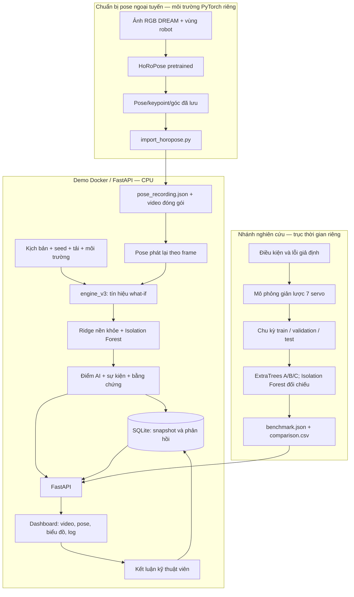
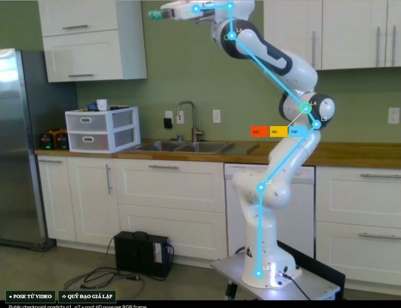
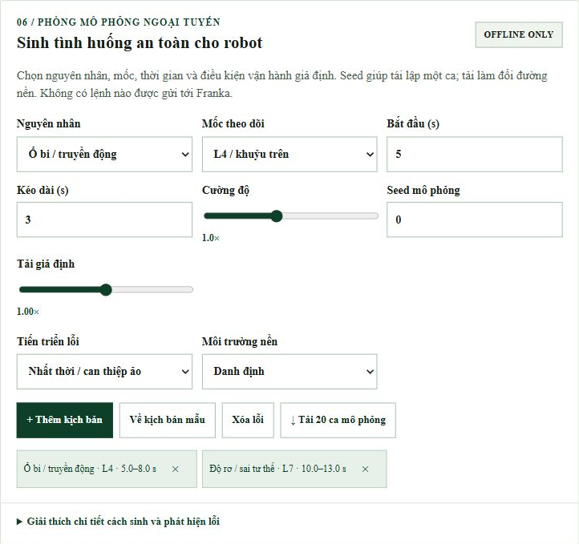
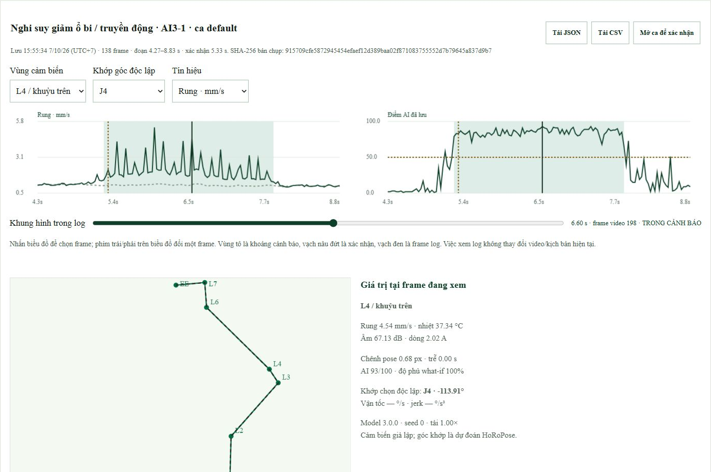
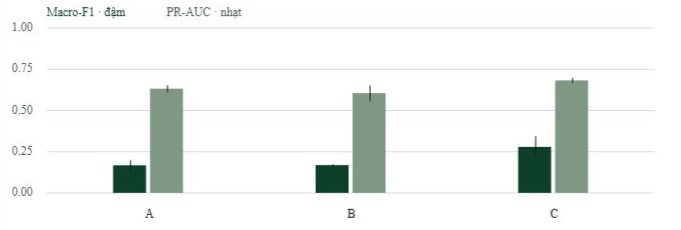
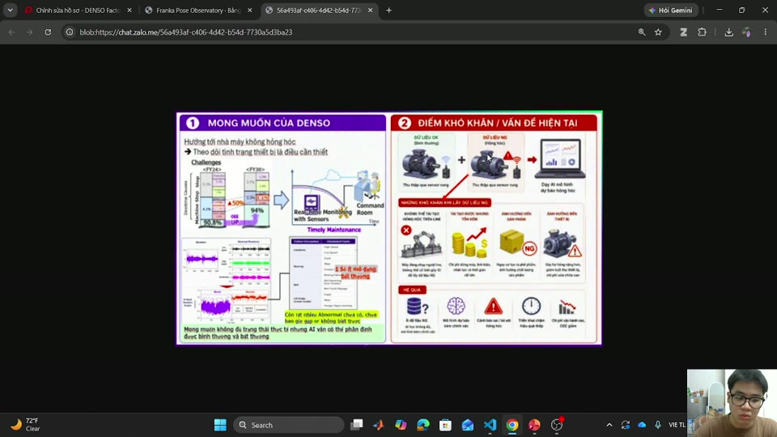

# DENSO 2026 · Giám sát pose Franka Panda và mô phỏng bảo trì

[](https://github.com/manhhung-25/DENS0-2026/actions/workflows/docker-demo.yml)

**Bài toán A2:** huấn luyện AI bảo trì dự đoán trong điều kiện thiếu dữ liệu lỗi. Dự án minh họa cách sinh dữ liệu bất thường ngoại tuyến, theo dõi robot đa nguồn, lưu bằng chứng và đo hiệu quả tăng cường dữ liệu.

**Dành cho ban tổ chức:** chạy `docker compose up --build -d --wait --wait-timeout 180`, rồi mở **http://127.0.0.1:8768/**. Cần cài Docker và clone repo trước; xem [hướng dẫn Docker](#chạy-nhanh-bằng-docker-dành-cho-btc) để thực hiện đầy đủ.

**Đi đến:** [Kiến trúc](#kiến-trúc-hệ-thống) · [Luồng dữ liệu](#sơ-đồ-luồng-dữ-liệu) · [Ảnh kết quả](#ảnh-chụp-kết-quả-từ-dashboard) · [Docker](#chạy-nhanh-bằng-docker-dành-cho-btc) · [Chạy Python](#chạy-dashboard) · [Hướng dẫn web](HUONG_DAN_SU_DUNG_WEB.md) · [Nghiên cứu](RESEARCH_GUIDE.md).

## Hệ thống làm được gì?

| Chức năng | Người dùng thao tác | Đầu ra để kiểm tra |
|---|---|---|
| Quan sát pose | Phát, dừng, tua video; chọn mốc ảnh và khớp góc độc lập | Overlay pose, tư thế, quỹ đạo và đạo hàm chuyển động |
| Theo dõi đa kênh | Chọn vùng và xem biểu đồ cùng thời điểm video | Rung, nhiệt độ, âm thanh, dòng điện và các chỉ số what-if |
| Sinh tình huống | Chọn nguyên nhân, vùng, thời gian, mức, tải, môi trường và seed | Tín hiệu giả lập có thể tái lập; xuất bộ ca |
| Phát hiện bất thường | So quan sát với nền khỏe học từ dữ liệu tổng hợp | Điểm bất thường, khoảng cảnh báo và giả thuyết kiểm tra |
| Lưu bằng chứng | Mở một sự kiện trong lịch sử | Pose và tín hiệu trước–trong–sau; xuất JSON/CSV; SHA-256 |
| Phản hồi bảo trì | Ghi kết luận, người kiểm tra, nguyên nhân và việc đã làm | Nhật ký xác nhận; bắt buộc mô tả nguyên nhân khi dự đoán sai |
| Đánh giá tăng cường | Xem A/B/C hoặc chạy benchmark | Macro-F1, PR-AUC, recall sự kiện, báo giả, độ trễ và ma trận nhầm lẫn |

**Dữ liệu nào có thật?** Ảnh RGB và nhãn đối chiếu đến từ DREAM. Pose/keypoint/góc là suy luận HoRoPose đã lưu, không phải encoder thật. Sensor, lỗi, đáp ứng what-if và benchmark là **tổng hợp**. Video gồm ảnh được dựng/phát lại; hệ thống **chưa nối camera, sensor hay controller DENSO**, không gửi lệnh gây lỗi đến robot. Điểm AI không phải xác suất hỏng và giả thuyết lỗi cần kỹ thuật viên xác nhận.

## Kiến trúc hệ thống



- **Nhánh pose:** mạng AI đã chạy ngoại tuyến. Docker demo đọc kết quả sẵn, không chạy HoRoPose mỗi frame.
- **Nhánh giám sát:** cảm biến vùng L…/EE là giả lập; chưa có ánh xạ sensor vật lý đến J1–J7 đã hiệu chuẩn.
- **Nhánh nghiên cứu:** tạo chu kỳ và đánh giá mô hình bằng đồng hồ riêng; không phải sensor ghi cùng video DREAM.
- **Lưu trữ:** snapshot giữ bằng chứng của ca đã tạo; xác nhận bảo trì ghi thêm nhật ký. SHA-256 dùng để đối chiếu thay đổi, không thay thế kiểm soát truy cập.

## Sơ đồ luồng dữ liệu

```mermaid
sequenceDiagram
    participant User as Người dùng
    participant Web as Dashboard
    participant API as FastAPI
    participant Engine as Bộ sinh + phát hiện
    participant DB as SQLite
    User->>Web: Chọn kịch bản, seed, tải, môi trường
    Web->>API: POST /api/run
    API->>Engine: Sinh và phân tích ca phát lại
    Engine-->>API: Timeline, điểm AI và sự kiện
    API->>DB: Lưu snapshot và chỉ mục sự kiện
    API-->>Web: ID ca chạy
    Web->>API: GET /api/run/{id}
    API-->>Web: Dữ liệu ca đã lưu
    User->>Web: Phát / tua video tới thời điểm t
    Web->>Web: i = round(t × fps); cập nhật mọi widget từ frame i
    User->>Web: Mở sự kiện trong lịch sử
    Web->>API: GET /api/history/{event_id}
    API->>DB: Đọc dữ liệu trước–trong–sau
    DB-->>API: Hồ sơ sự kiện đã lưu
    API-->>Web: Pose, sensor, score và nhật ký
    User->>Web: Xác nhận và mô tả việc kiểm tra
    Web->>API: POST phản hồi bảo trì
    API->>DB: Lưu kết luận và audit
```

**Hai loại thời gian:** `t` là giây trong video; `saved_at_utc` là lúc lưu hồ sơ. API phân tích toàn bộ ca ghi sẵn, sau đó trình duyệt phát lại bằng một chỉ số frame chung. Bước frame 33,33 ms của video 30 fps **không phải** độ trễ suy luận AI đã đo. Benchmark có thời gian chu kỳ riêng.

## Ảnh chụp kết quả từ dashboard

### Pose robot và phòng mô phỏng

| Pose trên ảnh robot | Cấu hình tình huống giả lập |
|---|---|
|  |  |

Ảnh chụp từ dashboard của dự án: điểm cyan là dự đoán pose; quỹ đạo what-if và sensor được gắn nhãn giả lập. Kịch bản được tạo trong phần mềm, không gây hỏng robot thật.

### Bằng chứng trước–trong–sau một cảnh báo



Đường liền là tín hiệu kịch bản; đường đứt là nền tổng hợp. Vùng tô thể hiện khoảng sự kiện; vạch nâu đứt là thời điểm xác nhận; vạch đen là frame đang xem. Người dùng chọn frame để xem pose, sensor và xuất JSON/CSV của hồ sơ đã lưu.

### So sánh AI trước và sau tăng cường dữ liệu



Kết quả benchmark nội bộ qua seed 19/41/73 trên cùng 174 ca kiểm thử tổng hợp: Macro-F1 A ≈ 0,167; B ≈ 0,169; C ≈ 0,279. Mức tăng C−A ≈ **11,17 điểm phần trăm**. Đây không phải độ chính xác tại nhà máy; C còn mức báo giả quy đổi khoảng 427 đợt/giờ trên các đoạn bình thường ngắn. Xem đầy đủ giới hạn, số liệu và cách tái lập trong [RESEARCH_GUIDE.md](RESEARCH_GUIDE.md).

## Chạy nhanh bằng Docker dành cho BTC

### 1. Chuẩn bị

- Cài [Docker Desktop](https://docs.docker.com/get-started/get-docker/) trên Windows/macOS hoặc Docker Engine kèm Compose trên Linux; bật **Linux containers**.
- Cài Git. Gói Docker dùng CPU, không cần GPU, Python trên máy host hoặc checkpoint HoRoPose.
- Lần build đầu cần mạng để tải base image và thư viện. Khi image đã có, demo phát lại chạy không cần gọi API AI bên ngoài.

Chạy tại thư mục gốc repo, **không phải `horopose_upstream/`**:

```powershell
git clone https://github.com/manhhung-25/DENS0-2026.git
Set-Location DENS0-2026
docker compose up --build -d --wait --wait-timeout 180
```

Trên Linux/macOS, dùng `cd DENS0-2026` thay cho `Set-Location`. Nếu repo đã có, vào thư mục gốc và chạy lệnh Compose cuối. Docker chỉ đóng gói video/pose sẵn, mã dashboard và pipeline nghiên cứu; không cần lấy Git LFS hoặc submodule để chạy chế độ này.

**Mở http://127.0.0.1:8768/**. Docker dùng cổng host **8768** để không trùng bản chạy Python tại **8767**; trong container ứng dụng nghe cổng 8767.

```powershell
docker compose ps
docker compose logs --tail 100 dashboard
```

Trạng thái mong đợi: service `dashboard` là `healthy`. API kiểm tra: http://127.0.0.1:8768/api/health. Badge **Docker demo** đầu README liên kết đến kết quả build/test trên GitHub Actions.

**Đã kiểm chứng ngày 08/10/2026:** image được build và chạy thành công trên runner Ubuntu của GitHub Actions; kiểm tra HTTP và dữ liệu sau restart đều đạt. Xem [log lần kiểm tra Docker](https://github.com/manhhung-25/DENS0-2026/actions/runs/37671400842). Đây là kiểm tra khả năng đóng gói/vận hành demo, không phải kiểm định độ chính xác lỗi thật.

### 2. Bài kiểm tra nhanh trên giao diện

1. Phát video, dừng hoặc tua; kiểm tra pose và giá trị các biểu đồ cùng thay đổi theo frame.
2. Chọn riêng vùng ảnh L4 và góc J4; đây là hai lựa chọn độc lập, không phải ánh xạ sensor vật lý.
3. Trong phòng mô phỏng, chọn **Về kịch bản mẫu**; xem rung/âm thanh khoảng 5–8 s và tình huống tư thế khoảng 10–13 s.
4. Chọn cảnh báo, xem thời điểm và giả thuyết; mở **Lịch sử pose và cảm biến** để đối chiếu các frame trước–trong–sau.
5. Thử xuất JSON/CSV. Nếu ghi xác nhận demo, dùng tên `BTC demo` và ghi rõ chưa thực hiện bảo trì robot thật.
6. Mở **Đánh giá AI** để xem kết quả A/B/C có sẵn. Danh sách ca nghiên cứu chi tiết và tải dataset xuất hiện sau khi tạo lại benchmark trong container.

### 3. Tự kiểm tra API và tái lập benchmark

```powershell
docker compose exec -T dashboard python scripts/smoke_test_web.py --state-file /data/smoke_check.json
docker compose restart dashboard
docker compose up -d --wait --wait-timeout 180
docker compose exec -T dashboard python scripts/smoke_test_web.py --state-file /data/smoke_check.json --verify-persistence
```

Bài smoke test tạo một ca và phản hồi có tên **Docker smoke test** trong DB demo; kiểm tra video, 500 frame, 7 kênh vùng, log, xuất file và việc giữ nguyên bằng chứng sau restart.

Tái lập đầy đủ bộ dữ liệu và mô hình nghiên cứu, chạy một lần và chờ lệnh kết thúc:

```powershell
docker compose exec -T dashboard python -m research_pipeline benchmark --seeds 19,41,73 --scarce 3 --extra 12 --output /data/research
```

Sau đó tải lại mục **Đánh giá AI**. Có thể dùng nút **Chạy benchmark 3 seed** thay cho CLI; không chạy cả hai đồng thời. Kết quả phụ thuộc môi trường thư viện/nền tảng và chỉ có giá trị trong mô phỏng.

### 4. Dữ liệu lưu và cách dừng

| Trong container | Nội dung | Cách giữ dữ liệu |
|---|---|---|
| `/app/pose_focus_demo/` | Video, pose và giao diện đóng gói | Nằm trong image |
| `/data/pose_demo.sqlite3` | Ca chạy, hồ sơ sự kiện và phản hồi bảo trì | Named volume `denso-data` |
| `/data/research/` | Kết quả, dataset và trọng số benchmark khi tái lập | Cùng named volume |

Volume mới được khởi tạo với bảng benchmark có sẵn trong image. Các lần khởi động sau dùng dữ liệu đang lưu trong volume; build lại image không tự ghi đè kết quả nghiên cứu đã có.

```powershell
docker compose down
```

Lệnh trên dừng container và giữ volume. Chạy lại bằng `docker compose up -d --wait --wait-timeout 180`. Để sao lưu khi app đã dừng, dùng `docker compose stop dashboard`, rồi `docker compose cp dashboard:/data ./docker-data-backup`; sau đó khởi động lại bằng lệnh `up`.

### 5. Xử lý lỗi thường gặp

| Hiện tượng | Cách xử lý |
|---|---|
| Không tìm thấy `docker` / Compose | Cài Docker, mở terminal mới, kiểm tra `docker version` và `docker compose version` |
| Không kết nối Docker daemon | Mở Docker Desktop hoặc khởi động Docker Engine; kiểm tra chế độ Linux containers |
| Cổng 8768 đã được dùng | PowerShell: `$env:DENSO_PORT="8770"`, rồi chạy Compose; mở `http://127.0.0.1:8770/`. Bash: `DENSO_PORT=8770 docker compose up --build -d --wait --wait-timeout 180` |
| Build chưa tải được thư viện | Kiểm tra mạng/proxy và log build; không bỏ qua lỗi cài dependency |
| Service chưa healthy | Xem `docker compose logs --tail 100 dashboard`; kiểm tra `/api/health` |
| Chưa có ca nghiên cứu để chọn | Chạy benchmark trong container; summary có sẵn không chứa toàn bộ NPZ/trọng số |
| Vẫn thấy benchmark cũ sau build | Volume giữ kết quả trước đó; chạy lại benchmark để cập nhật |

Docker dùng [Compose](https://docs.docker.com/compose/gettingstarted/) để khởi động và lưu volume; [.dockerignore](https://docs.docker.com/build/concepts/context/) loại môi trường cục bộ, checkpoint lớn và tài liệu khỏi build context.

## Video thuyết minh ý tưởng và giới thiệu hệ thống

[](https://github.com/manhhung-25/DENS0-2026/releases/download/demo-2026-10-08/thuyet_minh_y_tuong.mp4)

**[Xem hoặc tải video thuyết minh đầy đủ](https://github.com/manhhung-25/DENS0-2026/releases/download/demo-2026-10-08/thuyet_minh_y_tuong.mp4)** · Thời lượng **17 phút 06 giây** · MP4, H.264/AAC, 1280 × 720 · Khoảng **754 MiB**.

Nhấn ảnh xem trước hoặc liên kết trên để mở video; trình duyệt có thể tải file về, khi đó mở bằng trình phát video trên máy. Bản video gốc được lưu trong [GitHub Releases](https://github.com/manhhung-25/DENS0-2026/releases/tag/demo-2026-10-08), không nằm trong lịch sử Git của mã nguồn. Thông tin dung lượng và SHA-256 để đối chiếu nằm trong [manifest video](docs/media/thuyet_minh_y_tuong.json).

Đây là phần thuyết minh của **demo vòng ý tưởng**: pose được suy luận từ ảnh robot thật; cảm biến, tình huống lỗi và benchmark trong hệ thống là mô phỏng, chưa phải kết quả triển khai tại nhà máy DENSO.

**Cải tiến nghiên cứu v3:** [Hướng dẫn chạy bộ sinh bảy khớp, Isolation Forest, benchmark A/B/C và dashboard đánh giá](RESEARCH_GUIDE.md). Chạy `python -m research_pipeline benchmark --seeds 19,41,73 --output research_artifacts`, sau đó `python -m uvicorn app:app --app-dir pose_focus_demo --host 127.0.0.1 --port 8767`. Kết quả chỉ được kiểm chứng trên dữ liệu mô phỏng; các mốc pose trong video là dự đoán HoRoPose đã lưu. Phần **Đánh giá AI** hiển thị dữ liệu nghiên cứu có đồng hồ riêng; các biểu đồ giám sát tiếp tục dùng đồng hồ video.

Đây là hệ thống trình diễn chạy **ngoại tuyến**. Ảnh RGB của robot Franka Panda, checkpoint HoRoPose, mã suy luận, dự đoán q1–q7/pose 6D/keypoint và mã dựng video nằm trong `panda_repro/`, được giải nén từ `Panda_HoRoPose_Full_Repro.zip`. Dashboard trong `pose_focus_demo/` phát lại video và dùng trực tiếp kết quả HoRoPose đã lưu; mọi giá trị cùng bám timestamp `frame / 30`.

**Ranh giới dữ liệu:** ảnh RGB và nhãn đối chiếu thuộc tập DREAM; q1–q7 và keypoint là **dự đoán AI**, không phải encoder robot. Rung, âm thanh, nhiệt, dòng điện, trễ chu kỳ, sự cố và quỹ đạo what-if là **mô phỏng**. Chưa có camera hoặc cảm biến nối với robot nhà máy.


## Cấu trúc

| Đường dẫn | Vai trò |
|---|---|
| `panda_repro/data/panda_realsense/` | 120 ảnh RGB 480×640 và annotation DREAM `002640..002759` |
| `panda_repro/checkpoints/horopose_panda_realsense_inference.pk` | Trọng số HoRoPose Panda, 2.308 tensor, khoảng 320 MB |
| `panda_repro/vendor/holistic_pose/` | Mã HoRoPose upstream được đóng gói |
| `panda_repro/src/robot_demo/horopose_panda.py` | Nạp checkpoint, suy luận pose, hiệu chỉnh q từ 30 nhãn đầu, ghi NPZ/metrics |
| `panda_repro/src/robot_demo/make_panda_video.py` | Dựng video 500 frame, CSV cảm biến mô phỏng và sự kiện |
| `panda_repro/artifacts/` | NPZ dự đoán, CSV thời gian, mô hình lỗi, video, metrics và SQLite mẫu |
| `pose_focus_demo/import_horopose.py` | Kiểm tra hash, ánh xạ 120 scene ID sang 500 frame, ghi `pose_recording.json` |
| `pose_focus_demo/` | FastAPI, dashboard, biểu đồ, phòng mô phỏng, cảnh báo và phản hồi bảo trì |
| `research_pipeline/` | Bộ sinh 7 servo, đặc trưng cửa sổ, huấn luyện và benchmark A/B/C |
| `research_artifacts/benchmark.json`, `comparison.csv` | Kết quả tổng hợp nội bộ đã đóng gói |
| `Dockerfile`, `compose.yaml`, `requirements-docker.txt` | Gói chạy CPU cho BTC; lưu dữ liệu qua volume |
| `scripts/smoke_test_web.py` | Kiểm tra quy trình HTTP và dữ liệu sau restart |
| `.github/workflows/docker-demo.yml` | Build và kiểm tra container trên GitHub Actions |
| `docs/screenshots/` | Ảnh kết quả thật chụp từ dashboard demo |

Thư mục `horopose_upstream/` là Git submodule tham khảo của công trình gốc; `panda_repro/vendor/holistic_pose/` giúp gói tái lập chạy ngay cả khi chưa lấy submodule.

## Chạy dashboard

Yêu cầu Windows/Linux/macOS, Python 3.12, Git LFS và trình duyệt hỗ trợ H.264. Nếu lấy từ GitHub, tải cả trọng số và video LFS trước:

```powershell
git clone --recurse-submodules https://github.com/manhhung-25/DENS0-2026.git
Set-Location DENS0-2026
git lfs install
git lfs pull
```

Nếu đã clone trước đó, chạy `git submodule update --init --recursive` để lấy mã HoRoPose upstream. Các ca và trọng số benchmark nghiên cứu được tạo lại bằng lệnh trong [RESEARCH_GUIDE.md](RESEARCH_GUIDE.md); Git lưu mã nguồn và kết quả tổng hợp, không lưu môi trường `.venv`, cơ sở dữ liệu phản hồi cục bộ hoặc log chạy máy.

Sau đó, trên PowerShell tại thư mục chứa README:

```powershell
python -m venv .venv
.\.venv\Scripts\python.exe -m pip install -r requirements.txt
.\.venv\Scripts\python.exe pose_focus_demo\import_horopose.py
Set-Location pose_focus_demo
..\.venv\Scripts\python.exe -m uvicorn app:app --host 127.0.0.1 --port 8767
```

Mở <http://127.0.0.1:8767/>. Nếu chỉ muốn phát lại bản đã đóng gói, không cần chạy `import_horopose.py` mỗi lần. Dashboard vẫn mở khi không cài PyTorch: nó dùng kết quả suy luận đã lưu. Phản hồi kỹ thuật viên nằm trong SQLite ở `%LOCALAPPDATA%\DENSO\pose_demo.sqlite3` trên Windows; có thể đổi nơi lưu bằng `DENSO_DEMO_DB`.

Xem [hướng dẫn sử dụng web từ A–Z](HUONG_DAN_SU_DUNG_WEB.md): 18 phần về cài đặt và lệnh chạy, mối liên hệ giữa các khu vực, chọn landmark/khớp độc lập, ý nghĩa từng biểu đồ, cơ chế sinh/phát hiện lỗi, bảo trì, log lịch sử, xuất dữ liệu, benchmark A/B/C, bài thực hành và xử lý sự cố.

Các phiên bản đã chạy và lệnh kiểm tra chi tiết được ghi trong [môi trường đã xác minh](ENVIRONMENT_VERIFIED.md).

## Tái lập AI → dự đoán → video

Để kiểm chứng từ checkpoint và ảnh RGB, tạo **môi trường Python riêng** cho gói nghiên cứu. Trên PowerShell:

```powershell
Set-Location panda_repro
python -m venv .venv
.\.venv\Scripts\python.exe -m pip install -r requirements.txt
$env:PYTHONPATH = (Resolve-Path .\src).Path
.\.venv\Scripts\python.exe -m robot_demo.horopose_panda --batch-size 4 --output artifacts\verification\panda_pose_predictions.npz
.\.venv\Scripts\python.exe -m robot_demo.make_panda_video --predictions artifacts\verification\panda_pose_predictions.npz --output artifacts\verification\reproduced.mp4 --fault-model artifacts\fault_model.joblib --events artifacts\verification\events.db
```

Hai lệnh cuối tạo kết quả mới trong `artifacts/verification/`, giữ nguyên các artifact đã giao để đối chiếu hash. `pose_focus_demo/import_horopose.py` nạp bản gốc đã kiểm tra hash. `make_panda_video.py` tự ánh xạ các đường dẫn ảnh tuyệt đối cũ trong NPZ sang `data/panda_realsense/` tại máy hiện tại.

Trên Linux/WSL2, thay lệnh kích hoạt Python bằng `python3 -m venv .venv`, `source .venv/bin/activate`, `export PYTHONPATH="$PWD/src"`, rồi gọi `python -m ...`. Quá trình suy luận CPU có thể chậm; GPU cần phiên bản PyTorch tương thích máy. Checkpoint được nạp với `weights_only=True` và `strict=True`.

## Bằng chứng đã kiểm tra trên máy hiện tại

| Kiểm tra | Kết quả |
|---|---:|
| ZIP video so với file `.crdownload` ban đầu | Cùng SHA-256 `c91552e2…c21ac02e` |
| Checkpoint trong gói | SHA-256 `9c531ede…38026c181c3c`; nạp 2.308 tensor, epoch 76 |
| Suy luận lại từ checkpoint + 120 ảnh | 120/120 thành công, `strict=True` |
| Sai số q1–q7 trung bình sau hiệu chỉnh 30 nhãn đầu, lần chạy lại | 5,529° trên các frame DREAM này |
| Sai số keypoint 2D sau lọc thời gian, lần chạy lại | 7,554 pixel so với nhãn DREAM |
| Video dựng lại từ suy luận mới | 500 frame, 1280×720, 30 fps; chẩn đoán mô phỏng J4 được sinh |
| Predicted keypoint trong NPZ so với mốc cyan dashboard cũ | Sai khác trung vị 0,44 pixel tại các mốc nhận được |

Số q/keypoint của lần chạy lại hơi khác file đã giao do phiên bản PyTorch/NumPy. Video mới khác hash do phiên bản FFmpeg/encoder và nội dung sự kiện; các frame so sánh giống nhau ở mức hình ảnh, sai khác pixel trung bình khoảng 4–5/255. Xem [bằng chứng và giới hạn nguồn video](VIDEO_PROVENANCE.md) cùng `panda_repro/PANDA_BUILD_MANIFEST.md`.

## Cơ chế đồng bộ và mô phỏng

1. Mỗi dòng CSV nguồn có `frame`, `time_s`, `source_frame` và `cycle`; file NPZ dùng `scene_id` để lấy q, pose và 7 keypoint đúng ảnh nguồn. `import_horopose.py` chuyển keypoint từ ảnh 640×480 sang vùng video 840×646 và ghi 500 bản ghi.
2. Video dùng 120 ảnh theo chiều xuôi/ngược qua hai chu kỳ và một đoạn giữ hình 24 frame; **500 frame không phải 500 ảnh camera độc lập**. Biểu đồ q, sai số và bốn kênh mô phỏng được vẽ sẵn trong video đều đọc cùng bản ghi theo thời gian phát.
3. Phòng mô phỏng trên web là một nhánh what-if riêng. Nó giữ nguyên video và dự đoán HoRoPose, thêm tác động giả định lên cảm biến/quỹ đạo, sau đó phát hiện từ phần dư đa kênh. Biểu đồ “cảm biến trong video nguồn” và “cảm biến giả lập what-if” được gắn nhãn khác nhau.
4. Cảnh báo chỉ là kết quả của dữ liệu mô phỏng. Kỹ thuật viên có thể xác nhận đúng/sai, nhập nguyên nhân thực tế và việc đã làm; phản hồi lưu vào SQLite theo ca chạy.

Xem [README kỹ thuật dashboard](pose_focus_demo/README.md) để biết công thức tiêm lỗi, ngưỡng và giới hạn. Mô hình chưa được kiểm định để kết luận hỏng hóc ở nhà máy.

## Kiểm tra nhanh

```powershell
Set-Location pose_focus_demo
..\.venv\Scripts\python.exe -m unittest test_engine_v2.py test_horopose_integration.py
```

Gói repro có bài kiểm tra riêng trong `panda_repro/tests/`. Mã/ảnh/trọng số đã có trong bản tích hợp cục bộ; nếu sao chép dự án sang máy khác, phải chuyển cả `panda_repro/`, kể cả checkpoint và dataset. Một số tài nguyên gốc có điều kiện sử dụng riêng; xem tài liệu nguồn của DREAM và HoRoPose trước khi phân phối thương mại.
